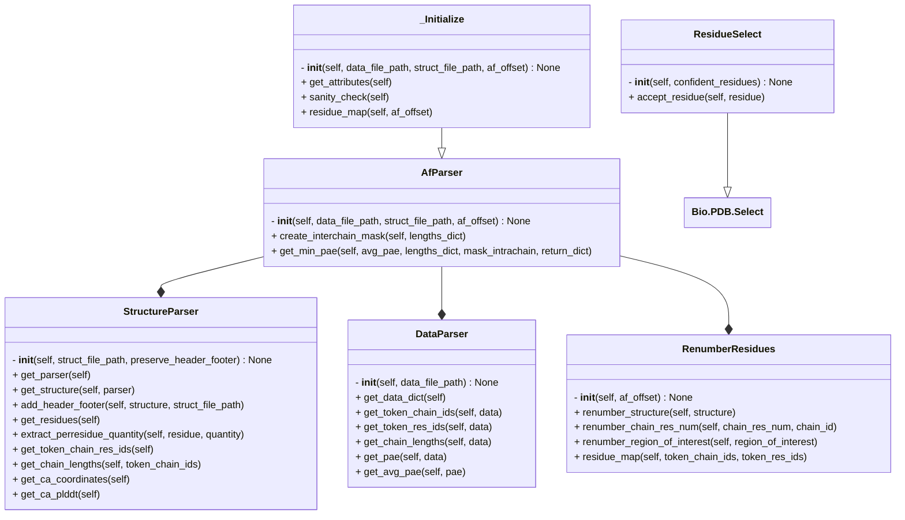

# AF-pipeline

This directory contains scripts to aid in alphafold related workflows

## AFinput

### Description
- A general script to create job files for AF server or fasta files for AlphaFold2/ ColabFold.

- Read the instructions in [AFInput](/docs/af_pipeline/AFInput.md) for details on how to use.

## Parser and _Initialize

- `Parser.py` has a number of methods to parse alphafold-predicted structure and the corresponding data file.

- The methods are arranged in different classes as follows.

- Some functions in `DataParser` (e.g. `get_token_res_ids`) are specific to AF3 data file format. However, if you want to analyse AF2 output, equivalent functions exist in `StructureParser`. Check docstrings of the functions for more details.

- Most of the methods in `StructureParser` are not restricted to AF-predicted structure can be used on any `.cif` or `.pdb`. So, it can be used for tasks such as renumbering residues in the structure with the help of `RenumberResidues`.

- `_Initialze` inherits from `Parser` and does not assume things such as number of chains in the structure or specific chain ids.

## RigidBodies

### Description

- Given an AF-prediction, extract all pseudo rigid domains from it.

- Read the instructions in [RigidBodies](/docs/af_pipeline/RigidBodies.md) for details on how to use.

- It is a wrapper over Tristan Croll's `pae_to_domains.py` script. (See [pae_to_domains](/af_pipeline/pae_to_domains/pae_to_domains.py) for more details)

- See [this](https://pmc.ncbi.nlm.nih.gov/articles/PMC9629492/) paper (section 4.2) for more details about the method.

## Interaction

### Description

- Given AF-prediction, get the following
  - contact map or distance map
  - interacting patches from contact map

- Read the instructions in [Interaction](/docs/af_pipeline/Interaction.md) for details on how to use.

## Organization of af_pipeline

## Tips to improve the coverage of Alphafold predictions

> [!NOTE]
> Here, coverage refers to the number of residues confidently modeled (at regular pLDDT >= 70 and PAE <= 10 or 12 cutoffs).

1. **Getting more models** Run jobs with more number of seeds. The more the merrier.

2. **Sequence truncations, using truncations from initial models of a larger complex** 

    i. Use sequence delineation (truncation) for Alphafold input in place of full-length sequences if there is previous data that supports the delineation.

    ii. Sometimes, interfaces that are modeled confidently in a small subcomplex are not confident in models of larger complexes. This is noticed for interfaces involving disordered regions in particular. One can then obtain an initial model of the large complex with the larger sequence range.  The pseudo-rigid domains from this model (output of `RigidBodies` withput pLDDT filter) can be used to delineate the sequence inputs to a subsequent second-round Alphafold prediction, where these interfaces are more likely to be confidently modeled. The first step simply eliminates the low-confidence regions and sequence regions that possibly do not interact with any protein in the complex.

    iii. In some cases, adding flanking regions (+/- 5 residues) might slightly improve prediction confidence. ([Chop Yan Lee et al., 2024](https://pmc.ncbi.nlm.nih.gov/articles/PMC10883280/))

3. **Relaxing PAE cutoff and relaxing PAE-based definition of pseudo-rigid domains**

    One can relax the PAE cutoff to 12, used in prior studies.

> [!NOTE]
> The PAE cutoffs  are only used for defining domains based on the PAE matrix, and not for identifying residue-residue contacts. Which means they can be more lenient.
>
> After getting rigid bodies, one can calculate the average interface PAE on the final rigid body to make sure the average interface PAE is small (less than 10).

4. **Relaxing pLDDT cutoff**

    One can additionally use lower pLDDT cutoffs for disordered regions (=50).

### References:
1. Chop Yan Lee, D. Hubrich, J.K. Varga, C. Schäfer, M. Welzel, E. Schumbera, M. Djokic, J.M. Strom, J. Schönfeld, J.L. Geist, F. Polat, T.J. Gibson, C. Isabelle, M. Kumar, O. Schueler-Furman, and K. Luck. 2024. Systematic discovery of protein interaction interfaces using AlphaFold and experimental validation. *Molecular Systems Biology*. doi:https://doi.org/10.1038/s44320-023-00005-6.
2. Omidi, A., M.H. Møller, N. Malhis, J.M. Bui, and J. Gsponer. 2024. AlphaFold-Multimer accurately captures interactions and dynamics of intrinsically disordered protein regions. Proceedings of the National Academy of Sciences of the United States of America. 121:e2406407121. doi:https://doi.org/10.1073/pnas.2406407121.
3. Bret, H., J. Gao, Diego Javier Zea, J. Andreani, and Raphaël Guerois. 2024. From interaction networks to interfaces, scanning intrinsically disordered regions using AlphaFold2. Nature Communications. 15. doi:https://doi.org/10.1038/s41467-023-44288-7.
4. Pei, J., and Q. Cong. 2023. AFTM: a database of transmembrane regions in the human proteome predicted by AlphaFold. Database. 2023. doi:https://doi.org/10.1093/database/baad008.

## Recommendations for getting oligomeric state from Alphafold

Ref: https://www.biorxiv.org/content/10.1101/2025.03.10.642518v1.full

1. Run jobs for different oligomeric states from AF2 and AF3.
2. If mean of the maximum ipTM score of each oligomeric state < 0.32 AF2 (0.24 AF3)  it is a monomer.
3. Look at the max iPTM score of any model in the oligomeric state to assign oligomeric state.
4. The oligomeric state prediction is likely to be accurate if:

    i. no low ipTM scores across all oligomeric states (incorrectly assigned states had low iPTMs across all states)

    ii. the monomeric pLDDT is high in AFDB and

    iii. there are no abnormally long alpha helices in the monomeric structure.

## Recommendations for getting PPIs from Alphafold

1.	Penalized iPTM score of peptide-protein (<0.27: random) ([Danneskiold-Samsøe et al Cell Sys 2024](https://doi.org/10.1016/j.cels.2024.10.004)). Penalized ipTM is calculated by taking the median iPTM of available predictions and subtracting the median absolute deviation (MAD) [Teufel et al JCIM 2022].

2.	actifPTM ([Varga et al., 2025](https://doi.org/10.1093/bioinformatics/btaf107))

3. ipSAE ([Dunbrack, 2025](https://www.biorxiv.org/content/10.1101/2025.02.10.637595v1))

4.	LIS ([Kim et al., 2024](https://www.biorxiv.org/content/10.1101/2024.02.19.580970v1))

5.	minD from distogram ([Omidi et al PNAS 2024](https://www.pnas.org/doi/10.1073/pnas.2406407121))