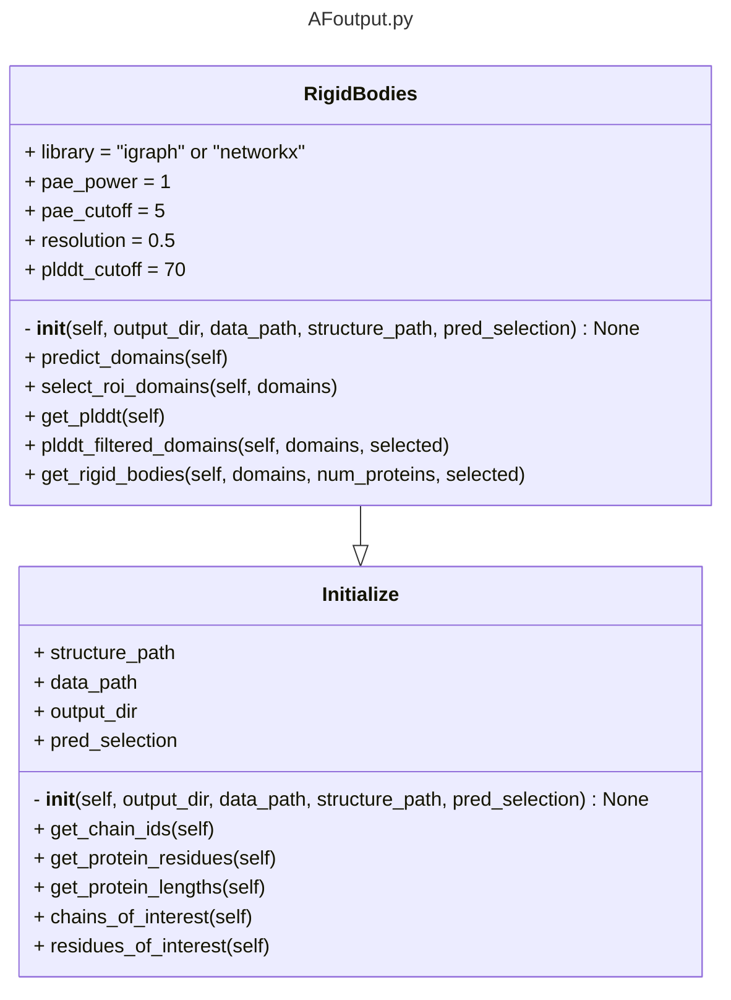

# AF-pipeline

This directory contains scripts to aid in alphafold related workflows

## AFinput

Create job files for AF-server. Check the following examples in the examples directory for usage.
- `create_af_jobs.py`

## AFoutput
### RigidBodies


#### Description
Using Alphafold information extract high-confidence regions from Alphafold for use as rigid bodies in IMP

<!--
Use one of these two methods
1. `get_high_confidence_region_from_af2.py` : uses plDDT and PAE to extract high-confidence regions. All residues with plDDT>70.0 are taken, and PAE domains from this subset are extracted to be modeled as rigid bodies in IMP. 
PAE domains correspond to residues with PAE values < 5 (all vs all residues).
This method is more stringent than the method below. 
-->

- uses Tristan Crolls' clustering based on only PAE to form domains (less stringent because all PAE values in a domain need not be <5) and filters the domains based on per-residue pLDDT.

Input: `.yaml` file in the following format 
```yaml
- structure_path: "path/to/af_structure.cif"  # This is not required
  data_path: "path/to/af_data.json"  # This is required
  selection:  # This is not required
    - id: "A"
      model_region: [400,745]
      af_region: [1,745]
    - id: "B"
      model_region: [635,1118]
      af_region: [630,1118]
```

- `srtucture_path` and `pred_selection` is optional
- If only `data_path` is provided, the output will be only based on PAE cutoff --> `get_rigid_bodies(predict_domains())`
- To apply pLDDT filter, `structure_path` is needed (structure is used to get per-residue pLDDT) --> `get_rigid_bodies(plddt_filtered_domains(predict_domains()))`
- `pred_selection` (`selection` in the above format) can be provided if AF-prediction is not full-length or modeled region is not the whole AF region. Note that this is not required, by default the first residue in the AF-prediction will be assigned '1' in the output list.

Currently the latter method is preferred. That is, getting domains based on PAE first and then filtering for plDDDT is slightly better because,
the former script only considers the split of the domains at the borders of confident residue stretch (pLDDT>=70). So, a domain boundary within such a stretch will be missed.
e.g. as shown below, for alpha-actinin monomer, ABD-SR domains is within a confident residue-stretch.

- Output from `predict_rigid_bodies.py`: correct identification of domain boundary of ABD:SR

- Output from `get_high_confidence_region_from_af2.py`: missed domain boundary of ABD-SR


ABD: Actin-binding domain
SR: Spectrin repeat

Refer to:
- `extract_af_rigid_bodies.py` in `IMP_Toolbox/examples`

#### Extract contacts or interface residues predicted confidently for use as restraints in IMP
WIP
