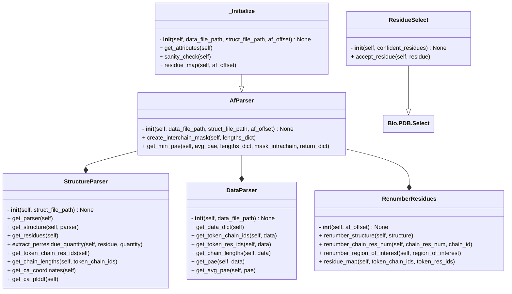
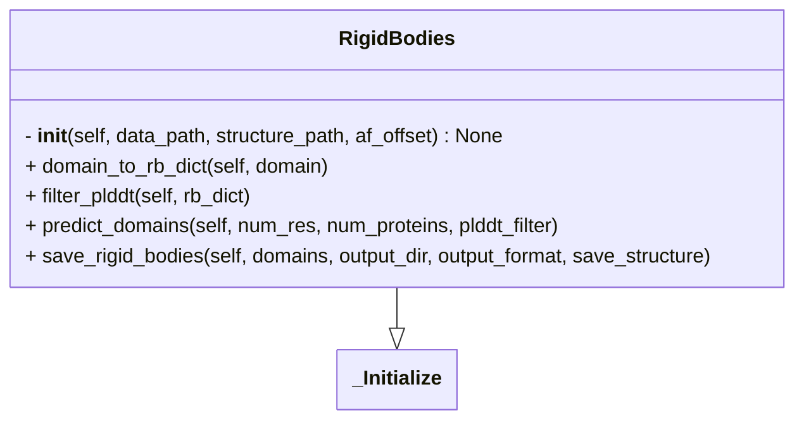
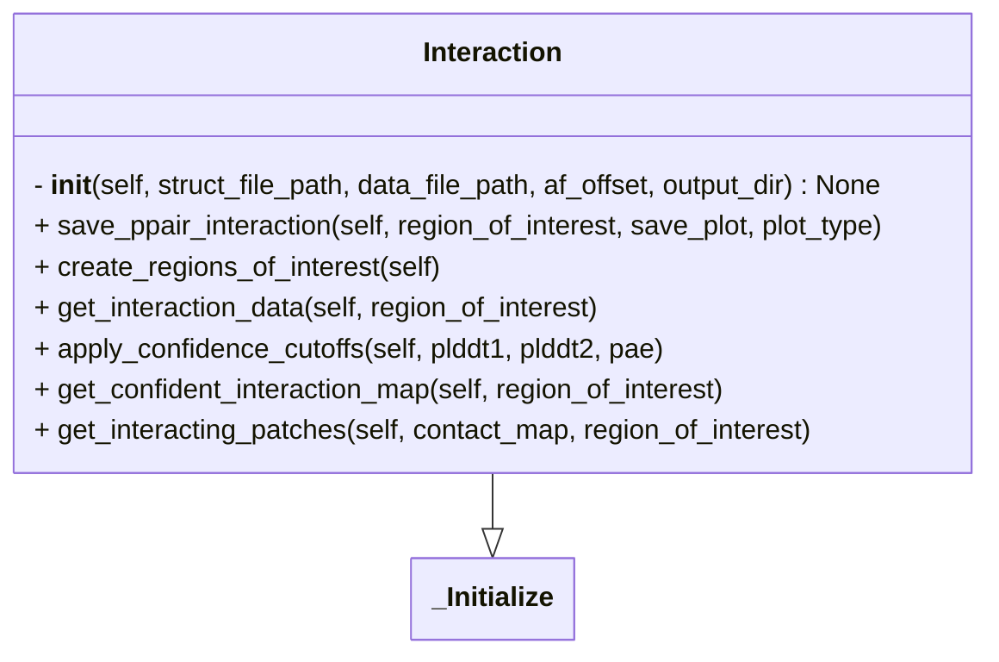
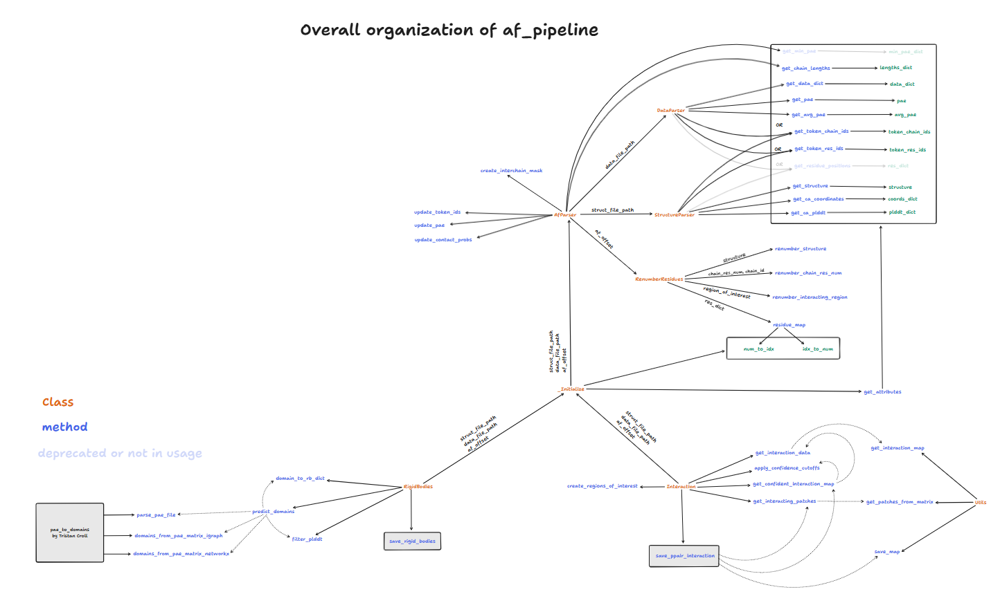

# AF-pipeline

This directory contains scripts to aid in alphafold related workflows

## AFinput
### Create job files for AF server
#### Description
- A general script to create job files for AF server.

**Input:** `.yaml` file in the following format.

```yaml
RNA_DNA_complex_8I54: # job cycle (required)
  - name: "Lb2Cas12a_RNA_DNA_complex" # job name  (not required)
    modelSeeds: [1,2] # 2 models with seeds 1 and 2 (not required)
    entities:
    # protein entity
      - name: "Lb2Cas12a" # (required)
        type: "proteinChain" # (required)
        count: 1
        glycans:
        - - "BMA"
          - 5
        modifications:
        - - "CCD_HY3"
          - 11
    # RNA entity
      - name: "RNA_33"
        type: "rnaSequence"
    # DNA entities
      - name: "DNA_25"
        type: "dnaSequence"
      - name: "DNA_mod"
        type: "dnaSequence"
        modifications: [["CCD_6OG", 2], ["CCD_6MA", 1]]
      - name: "MG"
        type: "ion"
        count: 1
```

- The only required keys are:
  1. job cycle
  2. name and type in entities

- For most of our use cases, the input will look like this:

```yaml
job_cycle:
# job 1
  - modelSeeds: 20
    entities:
      - name: "protein_1"
        type: "proteinChain"
      - name: "protein_2"
        type: "proteinChain"
# job 2
  - entities:
      - name: "dna_1"
        type: "dnaSequence"
      - name: "protein_2"
        type: "proteinChain"
```

**Usage:**
- For allowed entity types as well as PTMs, ligands and ions, refer to `af_constants.py` or [JSON file format for AlphaFold Server jobs](https://github.com/google-deepmind/alphafold/tree/main/server) 
- `modelSeeds` can either be an `int` or `list`.
  1. if `isinstance(modelSeeds, int)` -> `modelSeeds = random.sample(range(1, 10 * num_seeds), num_seeds)`
  2. if `isinstance(modelSeeds, list)` -> list taken as is

  Each seed in the list will considered as a new job.
- Input `yaml` file can contain multiple cycles, each with multiple jobs

```python
from af_pipeline.AFinput import AFInput

proteins = read_json("./input/proteins.json")
protein_sequences = read_fasta("./input/protein_sequences.fasta")
nucleic_acid_sequences = read_fasta("./input/nucleic_acid_sequences.fasta")
input_yml = yaml.load(open("./input/af_server_targets.yaml"), Loader=yaml.FullLoader)

af_input = AFInput(
    protein_sequences=protein_sequences, # required (output of fetch_sequences.py)
    input_yml=input_yml, # required
    nucleic_acid_sequences=nucleic_acid_sequences, # optional only in case of DNA or RNA sequences
    proteins=proteins, # optional if protein_sequences have protein names as headers and they match with input yaml
)

af_input.output_dir = args.output
job_cycles = af_input.create_job_cycles()
af_input.write_job_files(job_cycles=job_cycles)
```

Check the following examples in the examples directory for usage.
- `create_af_jobs.py`

## Parser and _Initialize
- `Parser.py` has a number of methods to parse alphafold-predicted structure and the corresponding data file.
- The methods are arranged in different classes as follows.

<mark> should RenumberResidues be in Parser or utils? </mark>



- Some functions in `DataParser` (e.g. `get_token_res_ids`) are specific to AF3 data file format. However, if you want to analyse AF2 output, equivalent functions exist in `StructureParser`. Check docstrings of the functions for more details.

- Most of the methods in `StructureParser` are not restricted to AF-predicted structure can be used on any `.cif` or `.pdb`. So, it can be used for tasks such as renumbering residues in the structure with the help of `RenumberResidues`.

- `_Initialze` inherits from `Parser` and does not assume things such as number of chains in the structure or specific chain ids.

## RigidBodies
### Description
- Given an AF-prediction, extract all pseudo rigid domains from it.
- It is a wrapper over Tristan Croll's `pae_to_domains.py` script. (See pae_to_domains for more details)



**Input:**
- `data_file_path` (required): AF2 or AF3 output data file (`pkl` or `.json`)
- `structure_file_path` (required if you need structure as an output): `.cif` file output from AF2 or AF3
- `af_offset` (not required): `[start, end]` of AF-prediction for each chain if the prediction is not full-length. By default, it is assumed to be `[1, len(protein_chain)]`


**Usage:**
```python
from af_pipeline.RigidBodies import RigidBodies

pred_to_analyses = {
  structure_path: "path/to/af_structure.cif",
  data_path: "path/to/af_data.json",
  af_offset: {
    "A": [20, 100],
    "B": [50, 750]
  }
}

structure_path = pred_to_analyse.get("structure_path")
data_path = pred_to_analyse.get("data_path")
af_offset = pred_to_analyse.get("af_offset")

af_rigid = RigidBodies(
    structure_path=structure_path,
    data_path=data_path,
    af_offset=af_offset,
)
```

```python
# parameters to vary
af_rigid.plddt_cutoff = 70
af_rigid.pae_cutoff = 5 # the maximum PAE value allowed between entities for them to be clustered into the same domain.
af_rigid.pae_power = 1
af_rigid.resolution = 0.5 # default value in ChimeraX
# lower value of resolution results in larger domains
af_rigid.library = "igraph" # "networkx" is slower
```

- `resolution` parameter can be varied to get different results (higher values will result in stricter clusters and thus smaller pseudo-domains)

```python
domains = af_rigid.predict_domains(
    num_res=5, # minimum number of residues in a domain
    num_proteins=2, # minimum number of proteins in a domain
)
```
- `num_proteins=2` ensures that only those pseudo-domains that have at-least two proteins are in the output.
- `num_res=5` ensures that each chain within a pseudo-domain has at least 5 residues.
- This will results in a list of dictionaries where each dict represents a pseudo-domain in the following format.

```python
rb1 = {
  "A": [20, 21, 22, 23, 25, 26],
  "B": [50, 51, 52, 53, 54, 55, 56]
}
```

- You can additionally apply pLDDT cutoff (`plddt_filter=True`) to remove low confidence residues from the structure.

```python
domains = af_rigid.predict_domains(
    num_res=5, # minimum number of residues in a domain
    num_proteins=2, # minimum number of proteins in a domain
    plddt_filter=True, # filter domains based on pLDDT score
)

af_rigid.save_rigid_bodies(
    domains=domains,
    output_dir=args.output,
    output_format="txt",
    save_structure=True, # if set to True, you will get each rigid body as a separate PDB
)
```
- Output will be a `.txt` file with residue ranges for each rigid body/ pseudo-domain.
- If you have multiple structures to analyse, you can specify the paths and af_offset in a single `.yaml` file. See the following example in the examples directory.

  - `af_rigid_bodies.py`

#### References:
- https://www.cgl.ucsf.edu/chimerax/docs/user/commands/alphafold.html#pae
- https://github.com/tristanic/pae_to_domains


## Interaction
### Description
- Given AF-prediction, get the following
  - contact map or distance map
  - interacting patches from contact map





**Input:**
- `data_file_path` (required): AF2 or AF3 output data file (`pkl` or `.json`)
- `structure_file_path` (required): `.cif` file output from AF2 or AF3
- `af_offset` (not required): `[start, end]` of AF-prediction for each chain if the prediction is not full-length. By default, it is assumed to be `[1, len(protein_chain)]`
- `output_dir` (not_required): path to save the output

**Usage:**

```python
from af_pipeline.Interaction import Interaction

pred_to_analyses = {
  structure_path: "path/to/af_structure.cif",
  data_path: "path/to/af_data.json",
  af_offset: {
    "A": [20, 100],
    "B": [50, 750]
  }
}

structure_path = pred_to_analyse.get("structure_path")
data_path = pred_to_analyse.get("data_path")
af_offset = pred_to_analyse.get("af_offset")

af_interaction = Interaction(
    struct_file_path=structure_path,
    data_file_path=data_path,
    af_offset=af_offset,
    output_dir="/path/to/output/",
)

# parameters to vary
af_interaction.plddt_cutoff = 70
af_interaction.pae_cutoff = 5
af_interaction.interaction_map_type = "contact" # or "distance"
af_interaction.contact_threshold = 8
```
- **Note:** to get interacting patches `interaction_map_type` has to be `"contact"`
- If one wants to check interaction within 20-40 residues of "A" and 50-70 residues of "B", region -f interest can be defined as follows:

```python
region_of_interest = {
  "A": [20, 40],
  "B": [50, 70]
}

af_interaction.save_interaction_info(
    region_of_interest=region_of_interest,
    save_plot=True,
    plot_type="interactive",
)
```
- Alternatively, one can use `create_regions_of_interest` to make interacting regions for all possible chain-pairs within the structure.

```python
regions_of_interest_ = af_interaction.create_regions_of_interest()

for region_of_interest in regions_of_interest_:

    af_interaction.save_interaction_info(
        region_of_interest=region_of_interest,
        save_plot=True,
        plot_type="static",
    )

```
- Interacting patches for each region of interest will be saved in a `.csv` file
- `save_plot=True` gives either of the following results.
  - if `plot_type=interactive`: `.html` file for each chain-pair
  - if `plot_type=static`: `.png` file for each chain-pair
  - if `plot_type=both`: both interactive sand static plots will be saved

