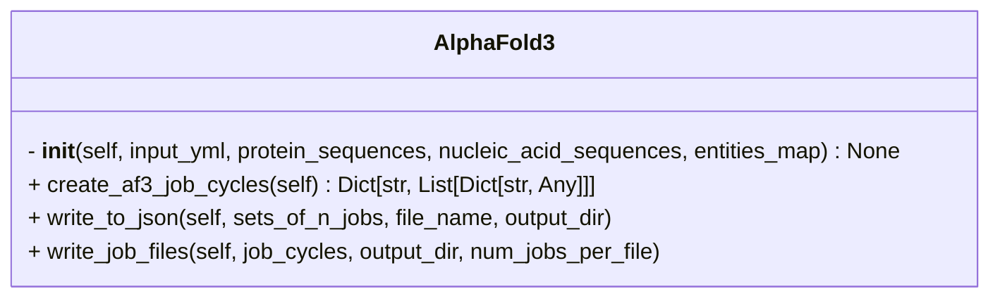
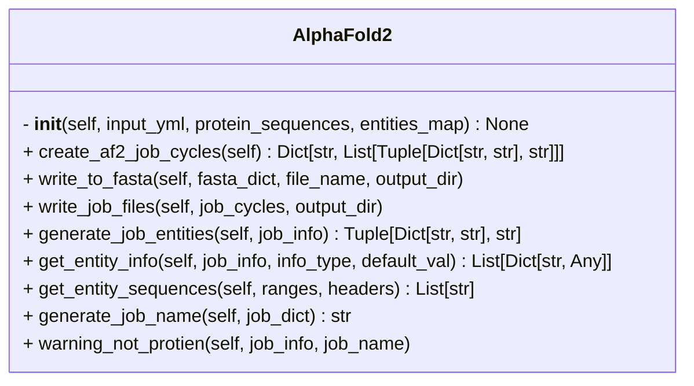
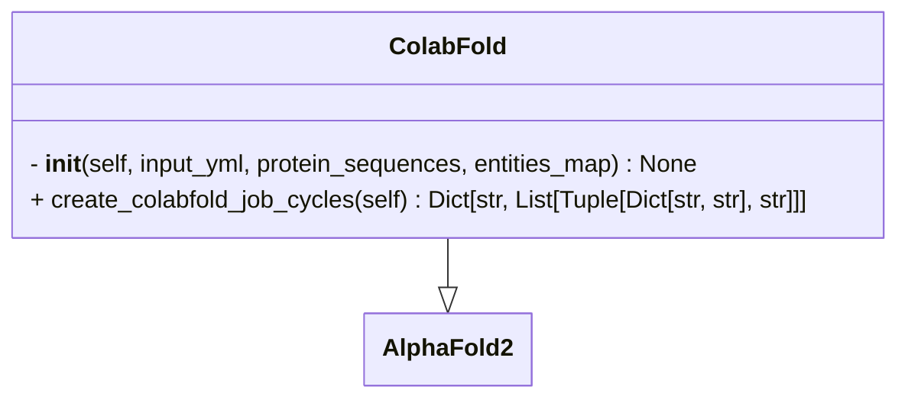

# AFinput

## Description
- A general script to create job files for AF server or fasta files for AlphaFold2/ ColabFold.

### Basic usage:

**Task**:
Given sequences of the two proteins, `Protein1` and `Protein2`. Create a job file for the following cases with 10 seeds for each job. (a) `Protein1:Protein2` (b) `Protein1:Protein1` (c) `Protein1(2 copies):Protein2` (d) `Protein1[50-600]:Protein2[20-50]`

**Steps**:

- Save all the protein sequences in a single fasta file.

```fasta
> Protein1
AGQWC....
> Protein2
PLDWS....
```

> [!NOTE]
> You can use `pre_processing.sequence.Sequence.FetchSequences` to get this fasta file if you have UniProt IDs of the proteins.

- Read the fasta file using `read_fasta` function in `utils`. This will give you a dictionary `{protein_name: sequence}`. The `protein_name` is the header in the fasta file.

```python
from utils import read_fasta

protein_sequences = read_fasta("/path/to/protein_sequences.fasta")
```

- make a dictionary as follows.

```python
input_yml = {
  "af_cycle_name": [
    {
      "modelSeeds": 10,
      "entities": [
        {
          "name": "Protein1",
          "type": "proteinChain"
        },
        {
          "name": "Protein2",
          "type": "proteinChain"
        }
      ]
    },
    ...
  ]
}
```

- Or specify the dictionary in a `yaml` file. (recommended)

```yaml
af_cycle_name:
  - modelSeeds: 10
    entities:
      - name: Protein1
        type: proteinChain
      - name: Protein1
        type: proteinChain
  - modelSeeds: [1, 2, 3, 4, 5, 6, 7, 8, 9, 10]
    entities:
      - name: Protein1
        type: proteinChain
        count: 2
  - modelSeeds: 10
    entities:
      - name: Portein1
        type: proteinChain
        count: 2
      - name: Protein2
        type: proteinChain
  - modelSeeds: 10
    entities:
      - name: Protein1
        range: [50, 600]
        type: proteinChain
      - name: Protein2
        range: [20, 50]
```

> [!NOTE]
> It is easier to define the `input_yml` dictionary in the `yaml` file.
> Check the examples directory.

- Import whichever class (`AlphaFold2`, `AlphaFold3`, `ColabFold`) you want to use from `AFInput` and create job cycles.

```python
from af_pipeline.AFInput import AlphaFold2, AlphaFold3, ColabFold

# For AF3 job files
af_input = AlphaFold3(
    protein_sequences=protein_sequences,
    input_yml=input_yml,
)

job_cycles = af_input.create_af3_job_cycles()

af_input.write_job_files(
    job_cycles=job_cycles,
    output_dir="../af_input_jobs",
    num_jobs_per_file=20, # upto 100 is allowed
)
```

- This will give you a `json` file in the specified output directory.

### Advanced usage:

- The only necessary inputs are `input_yml` and `protein_sequences` (and `nucleic_acid_sequences` if you are running prediction DNA or RNA involving complexes)

- `input_yml` is a dictionary: `{af_cycle: af_job_list}`.

- `protein_sequences` is a dictionary: `{protein_name: sequence}`

- `af_cycle` is the directory where the generated input `json`/`fasta` files will be stored.

- `af_job_list` is a list of `af_job`s. A single `af_job` is a dictionary and represents a single prediction. So, `af_job` should include all the `entities` that you want in the prediction along with their attributes (copy number, entity type, name, sequence range, etc.).

- So, you can specify variety of entity attributes in this dictionary but, the only essential attributes are - `type` (entity type) and `name` (entity name).
- The valid values of `type` are: `proteinChain`, `rnaSequence`, `dnaSequence`, `ion` (essentially whatever AF3 allows)

> [!NOTE]
> `type` is only really useful for AF3 as AF2 and ColabFold can only predict protein structures. 
> But, you can still use the same `input_yml` dictionary to create AF2/ColabFold job files. Any entity other than `proteinChain` will be ignored in such cases.

- `name` can take any value in `str` format in principle but, it is recommended to match the name to the key of the corresponding entity's sequences in the `protein_sequences` or `nucleic_acid_sequences` dictionary. Otherwise you'll have to provide an additional input dictionary `entities_map = {entity_name: key}`.

> [!NOTE]
> The above implementation seems weird but, it makes sense if you're using a `FetchSequences` from `pre_processing` to fetch protein sequences. In that case, Uniprot IDs are the headers for the sequences. And using `entities_map` you can map the headers to protein names. See cardiac desmosome repo or examples directory for reference.

- Once you have both these dictionaries, `input_yml` and `protein_sequences`. You can use the class of your choice from `AFInput` to generate the af job files (`fasta` or `json`).

```python
from af_pipeline.AFInput import AlphaFold2, AlphaFold3, ColabFold
from utils import read_fasta

protein_sequences = read_fasta("/path/to/protein_sequences.fasta")

# For AF3 job files
af_input = AlphaFold3(
    protein_sequences=protein_sequences,
    input_yml=input_yml,
)

job_cycles = af_input.create_af3_job_cycles()

af_input.write_job_files(
    job_cycles=job_cycles,
    output_dir="../af_input_jobs",
    num_jobs_per_file=20,
)
```

> [!NOTE]
> It is easier to define the `input_yml` dictionary in the `yaml` file.
> Check the examples directory or `config.yaml` in the cardiac desmosome repo.

<details>
<summary>
<span style="font-size: 18px"> <b>AlphaFold 3 (AlphaFold server)</b></span>
</summary>



```yaml
RNA_DNA_complex_8I54: # job cycle (required)
  - name: "Lb2Cas12a_RNA_DNA_complex" # job name  (not required)
    modelSeeds: [1,2] # 2 models with seeds 1 and 2 (not required)
    entities:
    # protein entity
      - name: "Lb2Cas12a" # (required)
        type: "proteinChain" # (required)
        count: 1
        glycans:
        - - "BMA"
          - 5
        modifications:
        - - "CCD_HY3"
          - 11
    # RNA entity
      - name: "RNA_33"
        type: "rnaSequence"
    # DNA entities
      - name: "DNA_25"
        type: "dnaSequence"
      - name: "DNA_mod"
        type: "dnaSequence"
        modifications: [["CCD_6OG", 2], ["CCD_6MA", 1]]
      - name: "MG"
        type: "ion"
        count: 1
```

- The only required keys are:
  1. job cycle
  2. name and type in entities

- For most of our use cases, the input will look like this:

```yaml
job_cycle:
# job 1
  - modelSeeds: 20
    entities:
      - name: "protein_1"
        type: "proteinChain"
      - name: "protein_2"
        type: "proteinChain"
# job 2
  - entities:
      - name: "dna_1"
        type: "dnaSequence"
      - name: "protein_2"
        type: "proteinChain"
```

**Usage:**
- For allowed entity types as well as PTMs, ligands and ions, refer to `af_constants.py` or [JSON file format for AlphaFold Server jobs](https://github.com/google-deepmind/alphafold/tree/main/server) 
- `modelSeeds` can either be an `int` or `list`.
  1. if `isinstance(modelSeeds, int)` -> `modelSeeds = random.sample(range(1, 10 * num_seeds), num_seeds)`
  2. if `isinstance(modelSeeds, list)` -> list taken as is

  Each seed in the list will be considered as a new job.
- Input `yaml` file can contain multiple cycles, each with multiple jobs

```python
from af_pipeline.AFinput import AlphaFold3

entities_map = read_json("./input/entities_map.json")
protein_sequences = read_fasta("./input/protein_sequences.fasta")
nucleic_acid_sequences = read_fasta("./input/nucleic_acid_sequences.fasta")
input_yml = yaml.load(open("./input/af_server_targets.yaml"), Loader=yaml.FullLoader)

af_input = AlphaFold3(
    protein_sequences=protein_sequences, # required (output of fetch_sequences.py)
    input_yml=input_yml, # required
    nucleic_acid_sequences=nucleic_acid_sequences, # optional only in case of DNA or RNA sequences
    entities_map=entities_map, # optional if protein_sequences have protein names as headers and they match with input yaml
)

af_input.output_dir = args.output
job_cycles = af_input.create_af3_job_cycles()
af_input.write_job_files(job_cycles=job_cycles)
```
</details>

<details>
<summary>
<span style="font-size: 18px"><b>AlphaFold2</b></span>
</summary>



**Input:** `.yaml` file in the same format as AlphaFold3.

**Output:** `.fasta` file in the following format.

```fasta
> seq1_header
sequence1
> seq2_header
sequence2
> seq3_header
sequence3
```

- Entities with type other than `proteinChain` will be ignored and only protein chains will be used to create the fasta file.
- Any modification of the protein will also be ignored.
- `Modelseeds` will also be ignored.

```yaml
# example input file for AlphaFold2

job_cycle:
  - entities:
    - name: "Act1"
      type: "proteinChain"
      range: [10, 375]
      count: 1
    - name: "Cdc3"
      type: "proteinChain"
      range: [1, 20]
      count: 1
```

- `range` and `count` are optional.


```python
from af_pipeline.AFinput import AlphaFold2

entities_map = read_json("./input/entities_map.json")
protein_sequences = read_fasta("./input/protein_sequences.fasta")
input_yml = yaml.load(open("./input/af_server_targets.yaml"), Loader=yaml.FullLoader)

af_input = AlphaFold2(
    protein_sequences=protein_sequences, # required (output of fetch_sequences.py)
    input_yml=input_yml, # required
    entities_map=entities_map, # optional if protein_sequences have protein names as headers and they match with input yaml
)

af_input.output_dir = args.output
job_cycles = af_input.create_af2_job_cycles()
af_input.write_job_files(job_cycles=job_cycles)
```
</details>


<details>
<summary>
<span style="font-size: 18px"><b>ColabFold</b></span>
</summary>



**Input:** `.yaml` file in the same format as AlphaFold3.

**Output:** `.fasta` file in the following format.

```fasta
> header or job name
sequence1:
sequence2:
sequence3
```

- This class inherits from `AlphaFold2`, only `crete_colabfold_job_cycles` is different

```yaml
# example input file for ColabFold

job_cycle:
  - entities:
    - name: "Act1"
      type: "proteinChain"
      range: [10, 375]
      count: 1
    - name: "Cdc3"
      type: "proteinChain"
      range: [1, 20]
      count: 1
```

- `range` and `count` are optional.


```python
from af_pipeline.AFinput import ColabFold

entities_map = read_json("./input/entities_map.json")
protein_sequences = read_fasta("./input/protein_sequences.fasta")
input_yml = yaml.load(open("./input/af_server_targets.yaml"), Loader=yaml.FullLoader)

af_input = ColabFold(
    protein_sequences=protein_sequences, # required (output of fetch_sequences.py)
    input_yml=input_yml, # required
    entities_map=entities_map, # optional if protein_sequences have protein names as headers and they match with input yaml
)

af_input.output_dir = args.output
job_cycles = af_input.create_colabfold_job_cycles()
af_input.write_job_files(job_cycles=job_cycles)
```

</details>

- Check `create_af_jobs.py` in the examples directory for usage.
- In all the above cases, if `job_name` is not provided, it will be generated as follows.

```python
# if we have two proteins
# 1. "Act1" with no range specified, count 1 and "Cdc3" with range [1, 20] and count 2.
job_name = "Act1_1_1to375_Cdc3_2_1to20_modelSeed"
```

> [!CAUTION]
> For AlphaFold server, there is a 100 char limit for `job_name`.


[:arrow_backward: back to af_pipeline](/af_pipeline/README.md)
