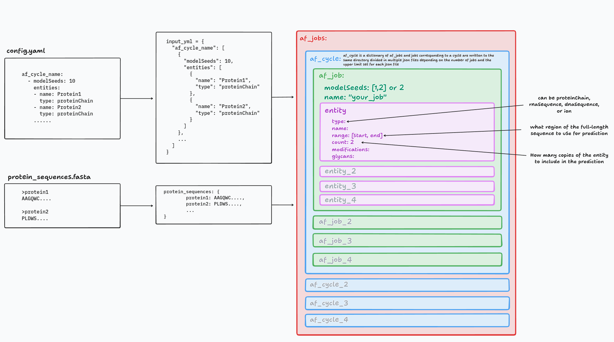

# AFinput

> [!NOTE]
> The impatient can go directly to the [`create_af_jobs.py`](../../examples/create_af_jobs.py) in the examples directory to see how to use this script.

## Description
- A module to create job files for AF-server[^af3] or fasta files for AlphaFold2[^af2]/ ColabFold[^colabfold].

[^af3]: Abramson, J. et al. Accurate structure prediction of biomolecular interactions with AlphaFold 3. Nature 630, 493–500 (2024). (https://alphafoldserver.com/)

[^af2]: Jumper, J. et al. Highly Accurate Protein Structure Prediction with Alphafold. Nature 596, 583–589 (2021).

[^colabfold]: Mirdita, M. et al. ColabFold: making protein folding accessible to all. Nature Methods 19, 679–682 (2022). (https://colab.research.google.com/github/sokrypton/ColabFold/blob/main/AlphaFold2.ipynb)

- The following is the idea behind this module:

  <p align="center">
    
  </p>

- It is most suitable in cases where you have multiple proteins, DNA, RNA, ligands, ions, etc. and you want to create large number of job files for AlphaFold3 server or fasta files for AlphaFold2/ColabFold with some variations in sequence range, PTMs, seeds, etc.


### Basic usage: (protein only without modifications)

**Task**:

Given sequences of the two proteins, `Protein1` and `Protein2`. Create a job file for the following cases with 10 seeds for each job. \
  (a) `Protein1:Protein2` \
  (b) `Protein1:Protein1` \
  (c) `Protein1(2 copies):Protein2` \
  (d) `Protein1[50-600]:Protein2[20-50]` (The values in the brackets denote the sequence range (start-end) to be used for the prediction)


**Steps**:

- Save all the protein sequences in a single fasta file.

```fasta
> Protein1
AGQWC....
> Protein2
PLDWS....
```

> [!TIP]
> You can use `pre_processing.sequence.Sequence.FetchSequences` to get this fasta file if you have UniProt IDs of the proteins.

- Read the fasta file using `read_fasta` function in [`utils`](../../utils.py). This will give you a dictionary

```python
from utils import read_fasta

protein_sequences = read_fasta("/path/to/protein_sequences.fasta")

# protein_sequences should look like this:
# {
#     "Protein1": "AGQWC....",
#     "Protein2": "PLDWS...."
# }
```

- make a dictionary as follows. (<mark>**NOT recommended**</mark>)

```python
input_yml = {
  "af_cycle_name": [
    {
      "modelSeeds": 10,
      "entities": [
        {
          "name": "Protein1",
          "type": "proteinChain"
        },
        {
          "name": "Protein2",
          "type": "proteinChain"
        }
      ]
    },
    ...
  ]
}
```

- Or specify the dictionary in a `yaml` file. (<mark>**recommended**</mark>). See [`config.yaml`](../../examples/input/config.yaml) for example usage including modfications, DNA, RNA and ligands.

```yaml
af_cycle_name:
  - modelSeeds: 10
    entities:
      - name: Protein1
        type: proteinChain
      - name: Protein1
        type: proteinChain
  - modelSeeds: [1, 2, 3, 4, 5, 6, 7, 8, 9, 10]
    entities:
      - name: Protein1
        type: proteinChain
        count: 2
  - modelSeeds: 10
    entities:
      - name: Portein1
        type: proteinChain
        count: 2
      - name: Protein2
        type: proteinChain
  - modelSeeds: 10
    entities:
      - name: Protein1
        range: [50, 600]
        type: proteinChain
      - name: Protein2
        range: [20, 50]
```

- `modelSeeds` can either be an `int` or `list`.

  1. if `isinstance(modelSeeds, int)` -> `modelSeeds = random.sample(range(1, 10 * num_seeds), num_seeds)`

  2. if `isinstance(modelSeeds, list)` -> list taken as is

  Each seed in the list will be considered as a new job. This option is <mark>**specific to AlphaFold3**</mark> server jobs and is ignored for AF2 or ColabFold jobs.

- If `job_name` is not provided, it will be generated as follows.

```python
# if we have two proteins
# 1. "Act1" with no range specified, count 1 and "Cdc3" with range [1, 20] and count 2.
# When no range is specified, the whole sequence in the fasta file is used.
job_name = "Act1_1_1to375_Cdc3_2_1to20_modelSeed"
```

> [!CAUTION]
> For AlphaFold server, there is a 100 char limit for `job_name`.

> [!NOTE]
> Each job cycle is a list of jobs
>
> Each job is a dictionary containing the entities and their attributes.
>
> An entity can be a protein chain, RNA sequence, DNA sequence, ion, etc.
>
> The attributes of an entity can include its name, type, range, count, modifications, etc.

- Import whichever class (`AlphaFold2`, `AlphaFold3`, `ColabFold`) you want to use from [`AFInput`](../../af_pipeline/AFInput.py) and create job cycles.


```python
from af_pipeline.AFInput import AlphaFold2, AlphaFold3, ColabFold

# For AF3 job files
af_input = AlphaFold3(
    protein_sequences=protein_sequences,
    input_yml=input_yml,
)

job_cycles = af_input.create_af3_job_cycles()

af_input.write_job_files(
    job_cycles=job_cycles,
    output_dir="../af_input_jobs",
    num_jobs_per_file=20, # upto 100 is allowed
)
```

- This will give you a `json` file in the specified output directory.

### Advanced usage: (protein, DNA, RNA, ligands, ions with modifications)

- The only necessary inputs are `input_yml` and `protein_sequences` (and `nucleic_acid_sequences` if you are predicting DNA or RNA involving complexes)

- `af_job_list` is a list of `af_job`s. A single `af_job` is a dictionary and represents a single prediction. So, `af_job` should include all the `entities` (proteins, nucleic acids, ligands) that you want in the prediction along with their attributes (copy number, entity type, name, sequence range, etc.).

- You can specify a number of entity attributes in this dictionary but, the **only essential** attributes are -
  - `type` (entity type, can be `proteinChain`, `rnaSequence`, `dnaSequence`, or `ion`)
  - `name` (entity name, can be any string)

> [!NOTE]
> `type` is only really useful for AF3 as AF2 and ColabFold can only predict protein structures.
> But, you can still use the same `input_yml` dictionary to create AF2/ColabFold job files. Any entity other than `proteinChain` will be ignored in such cases.

- `name` can take any value in `str` format in principle but, it is recommended to match the name to the key of the corresponding entity's sequences in the `protein_sequences` or `nucleic_acid_sequences` dictionary. Otherwise you'll have to provide an additional input dictionary `entities_map = {entity_name: key}`.

> [!NOTE]
> The above implementation seems weird, but it makes sense if you're using `FetchSequences` from [`pre_processing.sequence.Sequence`](../../pre_processing/sequence/Sequence.py) to fetch protein sequences.
>
> In that case, Uniprot IDs are the headers for the sequences. And using the same `entities_map` you used to fetch sequences, you can map the headers to protein names. See examples directory for reference.

- Once you have these dictionaries, `input_yml` and `protein_sequences`. You can use the class of your choice from `AFInput` to generate the af job files (`fasta` for AF2 or ColabFold or `json` for AF3-server).

```python
from af_pipeline.AFInput import AlphaFold3 # or AlphaFold2, ColabFold
from utils import read_fasta

protein_sequences = read_fasta("/path/to/protein_sequences.fasta")
nucleic_acid_sequences = read_fasta("/path/to/nucleic_acid_sequences.fasta")

# For AF3 job files
af_input = AlphaFold3(
    protein_sequences=protein_sequences,
    nucleic_acid_sequences=nucleic_acid_sequences,  # Optional, only needed if you have RNA or DNA entities
    input_yml=input_yml,
)

job_cycles = af_input.create_af3_job_cycles()

af_input.write_job_files(
    job_cycles=job_cycles,
    output_dir="../af_input_jobs",
    num_jobs_per_file=20,
)
```


## Input yaml specification
<details>
<summary>
<span style="font-size: 18px"> <b>AlphaFold 3 (AlphaFold server)</b></span>
</summary>

```yaml
RNA_DNA_complex_8I54: # job cycle (required)
  - name: "Lb2Cas12a_RNA_DNA_complex" # job name  (not required)
    modelSeeds: [1,2] # 2 models with seeds 1 and 2 (not required)
    entities:
    # protein entity
      - name: "Lb2Cas12a" # (required)
        type: "proteinChain" # (required)
        count: 1
        useStructureTemplate: true # by default set to true
        maxTemplateDate: "2023-01-01" # by default set to 2021-09-30
        glycans:
        - - "BMA"
          - 5
        modifications:
        - - "CCD_HY3"
          - 11
    # RNA entity
      - name: "RNA_33"
        type: "rnaSequence"
    # DNA entities
      - name: "DNA_25"
        type: "dnaSequence"
      - name: "DNA_mod"
        type: "dnaSequence"
        modifications: [["CCD_6OG", 2], ["CCD_6MA", 1]]
      - name: "MG"
        type: "ion"
        count: 1
```

- The only required keys are:
  1. job cycle
  2. name and type in entities

- `count` is an integer that indicates how many copies of the entity should be used in the prediction. By default, it is set to `1`. If you want to use multiple copies of the same entity, you can specify it here.

- `useStructureTemplate` is a boolean that indicates whether to use a structure template for the protein chain. By default, it is set to `true`.

- `maxTemplateDate` is a string that indicates the date till which the structure templates should be used. By default, it is set to `2021-09-30`. This means that only structures published before this date will be used as templates.

- `proteinChain` can have modifications:
  - `glycans` (list of lists, each sublist contains the glycan name and its position in the protein chain)
  - `modifications` (list of lists, each sublist contains the modification name and its position in the protein chain)
- `rnaSequence` and `dnaSequence` can have modifications:
  - `modifications` (list of lists, each sublist contains the modification name and its position in the RNA or DNA sequence)

- For most of our use cases, the input will look like this:

```yaml
job_cycle:
# job 1
  - modelSeeds: 20
    entities:
      - name: "protein_1"
        type: "proteinChain"
      - name: "protein_2"
        type: "proteinChain"
# job 2
  - entities:
      - name: "dna_1"
        type: "dnaSequence"
      - name: "protein_2"
        type: "proteinChain"
```

> [!TIP]
> For allowed entity types as well as PTMs, ligands and ions, refer to [`af_constants.py`](../../af_pipeline/af_constants.py) or [JSON file format for AlphaFold Server jobs](https://github.com/google-deepmind/alphafold/tree/main/server).

</details>

<details>
<summary>
<span style="font-size: 18px"><b>AlphaFold2</b></span>
</summary>

- Entities with type other than `proteinChain` will be ignored and only protein chains will be used to create the fasta file.

- Any modification in the `proteinChain` entities will also be ignored.

- `Modelseeds` will also be ignored.

```yaml
# example input file for AlphaFold2

job_cycle:
  - entities:
    - name: "Act1"
      type: "proteinChain"
      range: [10, 375]
      count: 1
    - name: "Cdc3"
      type: "proteinChain"
      range: [1, 20]
      count: 1
```

- `range` and `count` are optional.

</details>


<details>
<summary>
<span style="font-size: 18px"><b>ColabFold</b></span>
</summary>

- This class inherits from `AlphaFold2`, only `crete_colabfold_job_cycles` is different

```yaml
# example input file for ColabFold

job_cycle:
  - entities:
    - name: "Act1"
      type: "proteinChain"
      range: [10, 375]
      count: 1
    - name: "Cdc3"
      type: "proteinChain"
      range: [1, 20]
      count: 1
```

- `range` and `count` are optional.

</details>

[:arrow_backward: back to af_pipeline](/af_pipeline/README.md)
