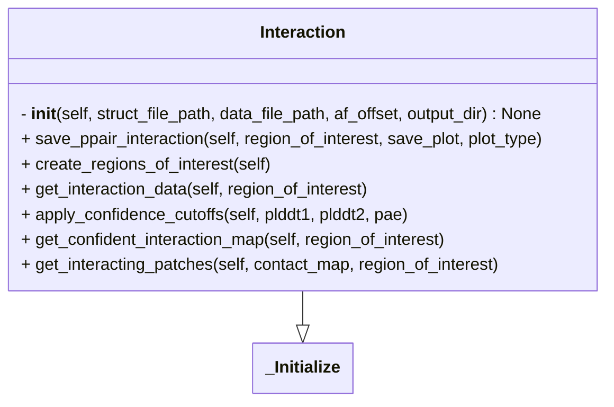

# Interaction

## Description

- Given AF-prediction, get the following
  - contact map or distance map
  - interacting patches from contact map




**Input:**

- `data_file_path` (required): AF2 or AF3 output data file (`pkl` or `.json`)

- `structure_file_path` (required): `.cif` file output from AF2 or AF3

- `af_offset` (not required): `[start, end]` of AF-prediction for each chain if the prediction is not full-length. By default, it is assumed to be `[1, len(protein_chain)]`

- `output_dir` (not_required): path to save the output

**Usage:**

```python
from af_pipeline.Interaction import Interaction

pred_to_analyses = {
  structure_path: "path/to/af_structure.cif",
  data_path: "path/to/af_data.json",
  af_offset: {
    "A": [20, 100],
    "B": [50, 750]
  }
}

structure_path = pred_to_analyse.get("structure_path")
data_path = pred_to_analyse.get("data_path")
af_offset = pred_to_analyse.get("af_offset")

af_interaction = Interaction(
    struct_file_path=structure_path,
    data_file_path=data_path,
    af_offset=af_offset,
    output_dir="/path/to/output/",
)

# parameters to vary
af_interaction.plddt_cutoff = 70
af_interaction.pae_cutoff = 5
af_interaction.interaction_map_type = "contact" # or "distance"
af_interaction.contact_threshold = 8
```
- **Note:** to get interacting patches `interaction_map_type` has to be `"contact"`
- If one wants to check interaction within 20-40 residues of "A" and 50-70 residues of "B", region of interest can be defined as follows:

```python
region_of_interest = {
  "A": [20, 40],
  "B": [50, 70]
}

af_interaction.save_interaction_info(
    region_of_interest=region_of_interest,
    save_plot=True,
    plot_type="interactive",
)
```
- Alternatively, one can use `create_regions_of_interest` to make interacting regions for all possible chain-pairs within the structure.

```python
regions_of_interest_ = af_interaction.create_regions_of_interest()

for region_of_interest in regions_of_interest_:

    af_interaction.save_interaction_info(
        region_of_interest=region_of_interest,
        save_plot=True,
        plot_type="static",
    )

```
- Interacting patches for each region of interest will be saved in a `.csv` file
- `save_plot=True` gives either of the following results.
  - if `plot_type=interactive`: `.html` file for each chain-pair
  - if `plot_type=static`: `.png` file for each chain-pair
  - if `plot_type=both`: both interactive sand static plots will be saved