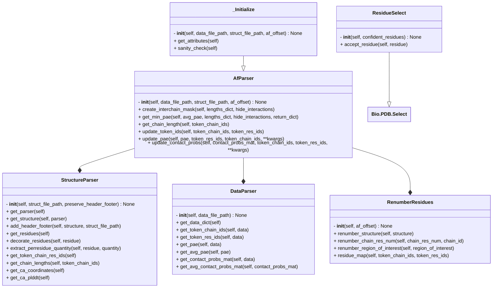

# Parser

- `Parser.py` has a number of methods to parse alphafold-predicted structure and the corresponding data file.

- The methods are arranged in different classes as follows.

<mark> should RenumberResidues be in Parser or utils? </mark>

- Some functions in `DataParser` (e.g. `get_token_res_ids`) are specific to AF3 data file format. However, if you want to analyse AF2 output, equivalent functions exist in `StructureParser`. Check docstrings of the functions for more details.

- Most of the methods in `StructureParser` are not restricted to AF-predicted structure can be used on any `.cif` or `.pdb`. So, it can be used for tasks such as renumbering residues in the structure with the help of `RenumberResidues`.
