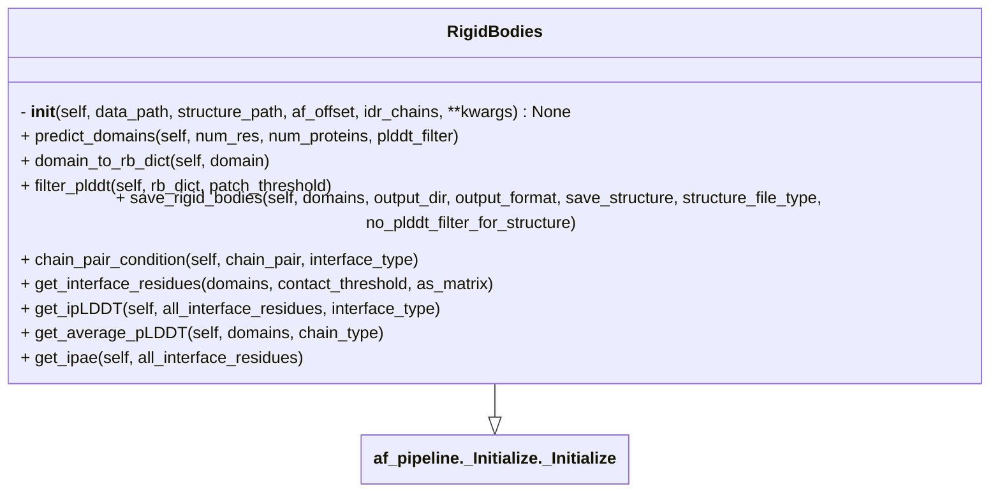

# RigidBodies

## Description

- Given an AF-prediction, extract all pseudo rigid domains from it.

- It is a wrapper over Tristan Croll's `pae_to_domains.py` script. (See [pae_to_domains](/af_pipeline/pae_to_domains/pae_to_domains.py) for more details)

- See [this](https://pmc.ncbi.nlm.nih.gov/articles/PMC9629492/) paper (section 4.2) for more details about the method.



**Input:**

- `data_file_path` (required): AF2 or AF3 output data file (`pkl` or `.json`)

- `structure_file_path` (required): `.cif` file output from AF2 or AF3

- `af_offset` (not required): `[start, end]` of AF-prediction for each chain if the prediction is not full-length. By default, it is assumed to be `[1, len(protein_chain)]`


**Usage:**

```python
from af_pipeline.RigidBodies import RigidBodies

pred_to_analyses = {
  structure_path: "path/to/af_structure.cif",
  data_path: "path/to/af_data.json",
  af_offset: {
    "A": [20, 100],
    "B": [50, 750]
  }
}

structure_path = pred_to_analyse.get("structure_path")
data_path = pred_to_analyse.get("data_path")
af_offset = pred_to_analyse.get("af_offset")

af_rigid = RigidBodies(
    structure_path=structure_path,
    data_path=data_path,
    af_offset=af_offset,
    idr_chains=["A"]
)
```

```python
# parameters to vary
af_rigid.plddt_cutoff = 70
af_rigid.plddt_cutoff_idr = 50 # you can set different cutoff for IDR
af_rigid.pae_cutoff = 12 # Edges will be created between all the residues < PAE cutoff
af_rigid.pae_power = 1
af_rigid.resolution = 0.5 # default value in ChimeraX
# lower value of resolution results in larger domains
af_rigid.library = "igraph" # "networkx" is slower
```

- `resolution` parameter can be varied to get different results (**higher** values will result in **stricter clusters** and thus **smaller pseudo-domains**)

```python
domains = af_rigid.predict_domains(
    num_res=5, # minimum number of residues in a domain
    num_proteins=2, # minimum number of proteins in a domain
)
```

- `num_proteins=2` ensures that only those pseudo-domains that have at-least two proteins are in the output.

- `num_res=5` ensures that each chain within a pseudo-domain has at least 5 residues.
- This will result in a list of dictionaries where each dict represents a pseudo-domain in the following format.

```python
rb1 = {
  "A": [20, 21, 22, 23, 25, 26],
  "B": [50, 51, 52, 53, 54, 55, 56]
}
```

- You can additionally apply pLDDT cutoff (`plddt_filter=True`) to remove low confidence residues from the structure.
- Setting `no_plddt_filter_for_structure=True` ignores the pLDDT filter in the rigid body in the `.pdb` or `.cif` format but not in the `.txt` format.

```python
domains = af_rigid.predict_domains(
    num_res=5, # minimum number of residues in a domain
    num_proteins=2, # minimum number of proteins in a domain
    plddt_filter=True, # filter domains based on pLDDT score
)

af_rigid.save_rigid_bodies(
    domains=domains,
    output_dir=args.output,
    output_format="txt",
    save_structure=True, # if set to True, you will get each rigid body as a separate PDB/CIF
    structure_file_type="pdb",
    no_plddt_filter_for_structure=True, # if set to True, pLDDT filter will be ignored for saving the PDB
)
```

- You can also assess the rigid body by calculating `ipLDDT`, `iPAE`, `average_pLDDT`.

```python
# average pLDDT
af_rigid.get_average_pLDDT(domains=domains, chain_type="any")
# valid values for chain_type are: "any", "idr", "r"

all_interface_residues = af_rigid.get_interface_residues(
    domains=domains,
    contact_threshold=8,
    as_matrix=False
)

af_rigid.get_ipLDDT(
  all_interface_residues=all_interface_residues,
  interface_type="any-any"
)

all_interface_residues = af_rigid.get_interface_residues(
    domains=domains,
    contact_threshold=8,
    as_matrix=True
)

af_rigid.get_ipae(
    all_interface_residues=all_interface_residues
)
```

- Output will be a `.txt` file with residue ranges for each rigid body/ pseudo-domain.
- If you have multiple structures to analyse, you can specify the paths and af_offset in a single `.yaml` file. See the following example in the examples directory.

  - `af_rigid_bodies.py`

> [!IMPORTANT]
> The default/ above suggested cutoffs do not work well with the coiled-coil predictions.
> Stricter cutoff is recommended (i.e. lower values of `pae_cutoff` and `resolution` and higher values of `pae_power`).
> The generated PAE images from the script can be used to guide the user in setting the cutoffs.

## References:
- https://www.cgl.ucsf.edu/chimerax/docs/user/commands/alphafold.html#pae
- https://github.com/tristanic/pae_to_domains
