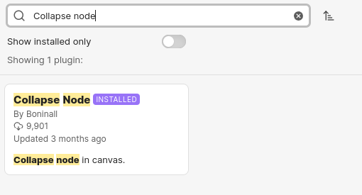
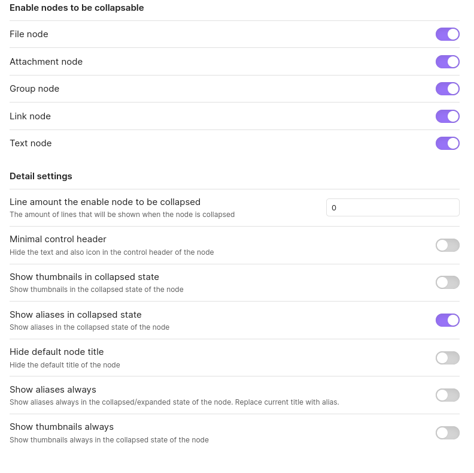

## How to properly navigate the Documentation

:construction:

- While you can navigate the documentation in the browser, it is recommended to use the Obsidian app for a better navigation.

- Download Obsidian from https://obsidian.md/download

- Clone the IMP_Toolbox repository or download the ZIP file.

```bash
git clone git@github.com:isblab/IMP_Toolbox.git
```

- Open Obsidian, you'll be prompted to create a new vault. If not, go to `manage vaults` at the bottom left corner.

- Select `Open folder as vault` and select the `IMP_Toolbox/docs/imp_toolbox_obs_vault` folder.

- Go to `Settings` > `Community plugins` > `Browse`.

- Find the plugin `Collapse Node` by Boninall
    

- Install the plugin and enable it.

- Make sure the plugin options are set as follows:
    

- Open `imp_toolbox_obs_vault/Canvases/af_pipeline.canvas` in Obsidian. You can navigate the entire documentation of `af_pipeline` within this the canvas.