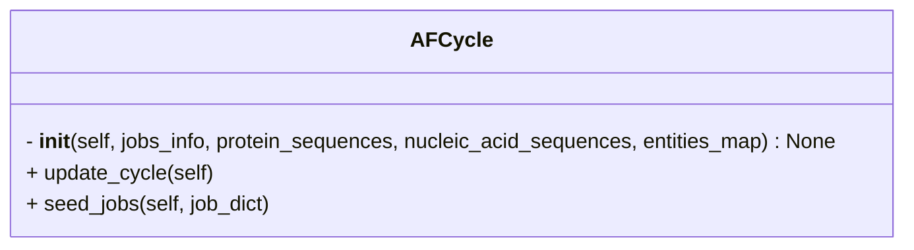

```python
class AFCycle
```



## Input

- **jobs_info** (`List[Dict[str, Any]]`)
	- List of all jobs within a cycle.
	- e.g. 
```python
# The following are all the jobs within cycle `Actin_profilin_targets` in config.yaml
jobs_info = [
	{
		'entities': [
			{'name': 'Act1', 'range': [1, 375], 'type': 'proteinChain'},
	        {'name': 'Cdc3', 'range': [11, 120], 'type': 'proteinChain'}
	    ],
		'modelSeeds': 2 # number of seeds
	},
	{
		'entities': [
			{'name': 'Act1', 'type': 'proteinChain'},
			{'name': 'Cdc3', 'type': 'proteinChain'}
		],
	},
	{
		'entities': [
			{'name': 'Act1', 'type': 'proteinChain'},
			{'name': 'Cdc3', 'type': 'proteinChain'},
			{'count': 1, 'name': 'CCD_ATP', 'type': 'ligand'},
			{'count': 1, 'name': 'MG', 'type': 'ion'}
		],
		'name': 'actin_profilin_complex' # job_name
	}
]
```

- **protein_sequences** (`Dict[str, str]`)
	- Dictionary mapping Uniprot IDs/protein names to their amino acid sequences
	- e.g.
```python
protein_sequences = {
	'Lb2Cas12a': 'MYYESLTKQYPVS...',
	'P10989': 'MEEEIAALVID...',
	'P15924-1': 'MSCNGGSHPRINT...',
	'P39825': 'MSWQAYVDTSLLGT...'
}
```

- **nucleic_acid_sequences** (`Dict[str, str] | None = None`)
	- Dictionary mapping DNA/RNA entity name to their nucleotide sequences
	- e.g.
```python
nucleotide_sequences = {
	'DNA_25': 'TGGTCGGGGTAGCGGCTAAAGCACT',
	'DNA_mod': 'AGTGCTTTA',
	'RNA_33': 'AAUUUCUACUAAUUGUAGAUGCCGCUACCCCGA'}
```

- **entities_map** (`Dict[str, str] = {}`)
	- Mapping of entity names to their identifiers (e.g., Uniprot ID). Defaults to an empty dictionary
	- This is optional input and need not be specified if the sequence headers in `protein_sequences` match the entities name in the `jobs_info`.
	- e.g.
```python
entities_map = {
	'Act1': 'P10989',
	'Cdc3': 'P39825',
	'Dp1': 'P15924-1',
	'Lb2Cas12a': None
}
```


## Attributes

- **job_list** (`List`)
	- A list of jobs where each job is a dictionary in AF3 compatible format.
	- e.g.
```python
# a job list with one job
job_list = [{
	'modelSeeds': [10],
	'name': 'Act1_1_1to375_Cdc3_1_11to120_10',
	'sequences': [
		{
			'proteinChain': {
				'count': 1,
				'glycans': [],
				'maxTemplateDate': '2021-09-30',
				'modifications': [],
				'sequence': 'MEEEI....',
				'useStructureTemplate': True
			}
		},
		{
			'proteinChain': {
				'count': 1,
				'glycans': [],
				'maxTemplateDate': '2021-09-30',
				'modifications': [],
				'sequence': 'LLGTGKI...',
				'useStructureTemplate': True
			}
		}
	]
}]
```

- **jobs_info** (`List[Dict[str, Any]]`)
	- same as [[#Input]] : jobs_info

- **protein_sequences** (`Dict[str, str]`)
	- same as [[#Input]] : protein_sequences

- **nucleic_acid_sequences** (`Dict[str, str] | None = None`)
	- same as [[#Input]] : nucleic_acid_sequences

- **entities_map** (`Dict[str, str] = {}`)
	- same as [[#Input]] : entities_map

## Methods

- [[update_cycle]]
- [[seed_jobs]]

## Tags
#class 