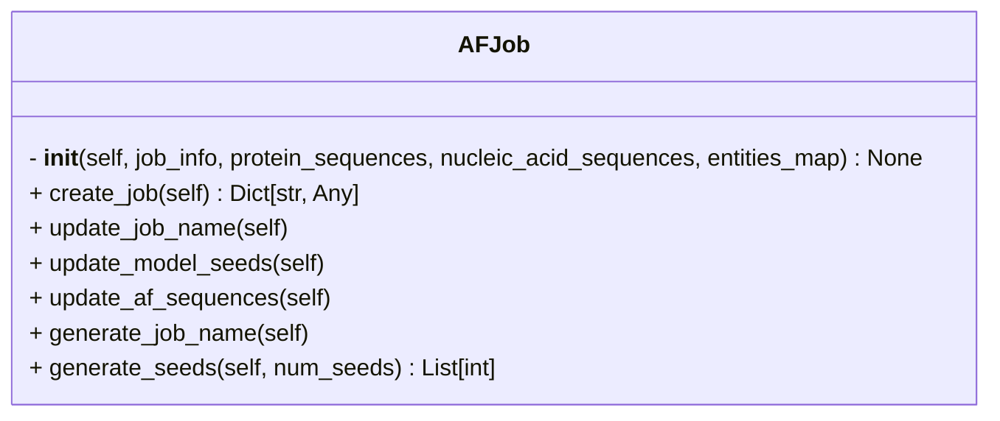

```python
class AFJob
```



## Input

- **job_info** (`Dict[str, Any]`) ^14de6d
	- A dictionary containing all the info about an `af_job`.
```python
job_info = {
	'entities': [
		{'name': 'Act1', 'range': [1, 375], 'type': 'proteinChain'},
		{'name': 'Cdc3', 'range': [11, 120], 'type': 'proteinChain'}
	],
	'modelSeeds': 2
}
```

- **protein_sequences** (`Dict[str, str]`) ^7568d0
	- Dictionary mapping Uniprot IDs/protein names to their amino acid sequences
	- e.g.
```python
protein_sequences = {
	'Lb2Cas12a': 'MYYESLTKQYPVS...',
	'P10989': 'MEEEIAALVID...',
	'P15924-1': 'MSCNGGSHPRINT...',
	'P39825': 'MSWQAYVDTSLLGT...'
}
```

- **nucleic_acid_sequences** (`Dict[str, str] | None = None`) ^8ed0dd
	- Dictionary mapping DNA/RNA entity name to their nucleotide sequences
	- e.g.
```python
nucleotide_sequences = {
	'DNA_25': 'TGGTCGGGGTAGCGGCTAAAGCACT',
	'DNA_mod': 'AGTGCTTTA',
	'RNA_33': 'AAUUUCUACUAAUUGUAGAUGCCGCUACCCCGA'}
```

- **entities_map** (`Dict[str, str] = {}`) ^05bf20
	- Mapping of entity names to their identifiers (e.g., Uniprot ID). Defaults to an empty dictionary
	- This is optional input and need not be specified if the sequence headers in `protein_sequences` match the entities name in the `jobs_info`.
	- e.g.
```python
entities_map = {
	'Act1': 'P10989',
	'Cdc3': 'P39825',
	'Dp1': 'P15924-1',
	'Lb2Cas12a': None
}
```

## Attributes

- **af_sequences** (`List`)
	- A list of dictionaries with each dictionary corresponding to an entity along with their attributes in AF3 compatible format.
	- e.g.
```python
af_sequences = [
	{
		'proteinChain': {
			'sequence': 'MEEEIAA..',
			'glycans': [],
			'modifications': [],
			'count': 1,
			'maxTemplateDate': '2021-09-30',
			'useStructureTemplate': True
		}
	}, 
	{
		'proteinChain': {
		'sequence': 'LLGT...',
		'glycans': [],
		'modifications': [],
		'count': 1,
		'maxTemplateDate': '2021-09-30',
		'useStructureTemplate': True
		}
	}
]
```

- **job_info** (`Dict[str, Any]`)
	- same as [[#^14de6d|job_info]]

- **protein_sequences** (`Dict[str, str]`)
	- same as [[#^7568d0|protein_sequences]]

- **nucleic_acid_sequences** (`Dict[str, str] | None = None`)
	- same as [[#^8ed0dd|nucleic_acid_sequences]]

- **entities_map** (`Dict[str, str] = {}`)
	- same as [[#^05bf20|entities_map]]

- **name_fragments** (`List`)
	- A list of strings that will be used to define the `job_name` in case it is not provided in the input `config.yaml`
	- e.g.
```python
name_fragments = ['Act1_1_1to375', 'Cdc3_1_11to120']
```

- **model_seeds** (`List`)
	- A list of random seeds. This will go to `modelSeeds` parameter in AF-server input.
	- e.g.
```python
model_seeds = [6, 10]
```

- **job_name** (`str | None = None`)
	- job name - generated or provided by user
	- e.g.
```python
job_name = "Act1_1_1to375_Cdc3_1_11to120"
```

## Methods
- [[create_job]]
- [[update_job_name]]
- [[update_model_seeds]]
- [[update_af_sequences]]
- [[af_pipeline/AFInput/AFJob/generate_job_name|generate_job_name]]
- [[generate_seeds]]

## Tags
#class 