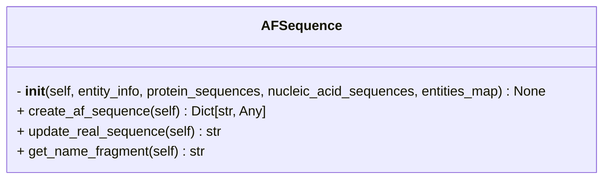

```python
class AFSequence(Entity)
```




- inherits [[Entity]]

## Input

- **entity_info** (`Dict[str, Any]`) ^5d01f2
	- Dictionary containing entity attributes.
	- e.g.
```python
entity_info = {
	'name': 'Lb2Cas12a',
	'type': 'proteinChain',
	'count': 1,
	'useStructureTemplate': True,
	'maxTemplateDate': '2023-01-01',
	'glycans': [['BMA', 5]],
	'modifications': [['CCD_HY3', 11]]
}
```

- **protein_sequences** (`Dict[str, str]`) ^7568d0
	- Dictionary mapping Uniprot IDs/protein names to their amino acid sequences
	- e.g.
```python
protein_sequences = {
	'Lb2Cas12a': 'MYYESLTKQYPVS...',
	'P10989': 'MEEEIAALVID...',
	'P15924-1': 'MSCNGGSHPRINT...',
	'P39825': 'MSWQAYVDTSLLGT...'
}
```

- **nucleic_acid_sequences** (`Dict[str, str] | None = None`) ^8ed0dd
	- Dictionary mapping DNA/RNA entity name to their nucleotide sequences
	- e.g.
```python
nucleotide_sequences = {
	'DNA_25': 'TGGTCGGGGTAGCGGCTAAAGCACT',
	'DNA_mod': 'AGTGCTTTA',
	'RNA_33': 'AAUUUCUACUAAUUGUAGAUGCCGCUACCCCGA'}
```

- **entities_map** (`Dict[str, str] = {}`) ^05bf20
	- Mapping of entity names to their identifiers (e.g., Uniprot ID). Defaults to an empty dictionary
	- This is optional input and need not be specified if the sequence headers in `protein_sequences` match the entities name in the `jobs_info`.
	- e.g.
```python
entities_map = {
	'Act1': 'P10989',
	'Cdc3': 'P39825',
	'Dp1': 'P15924-1',
	'Lb2Cas12a': None
}
```

## Attributes

- **name** (`str = Entity.entity_name`)
	- entity name

- **type** (`str = Entity.entity_type`)
	- entity type. One of the `proteinChain`, `dnaSequence`, `rnaSequence`, or `ion`

- **count** (`int = Entity.entity_count`)
	- Number of copies of the entity

- **real_sequence** (`str = self.update_real_sequence`)
	- Amino acid sequence or nucleotide sequence or [CCD](https://www.wwpdb.org/data/ccd) symbol of the entity

## Methods

- [[create_af_sequence]]
- [[update_real_sequence]]
- [[get_name_fragment]]

## Tags
#class 