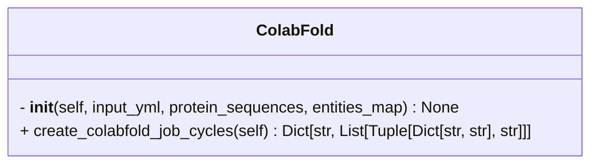

```python
class ColabFold(AlphaFold2)
```



- inherits [[AlphaFold2]]

## Input

- **input_yml** (`Dict[str, List[Dict[str, Any]]]`) ^54c8f5
	- Dictionary containing job cycles and their respective jobs.
	- e.g.
```python
input_yml = {
	'Actin_profilin_targets': [
		{'entities': [{'name': 'Act1',
					   'range': [1, 375],
					   'type': 'proteinChain'},
					  {'name': 'Cdc3',
					   'range': [11, 120],
					   'type': 'proteinChain'}],
		 'modelSeeds': 2},
		{'entities': [{'name': 'Act1',
					   'type': 'proteinChain'},
					  {'name': 'Cdc3',
					   'type': 'proteinChain'}]},
		{'entities': [{'name': 'Act1',
					   'type': 'proteinChain'},
					  {'name': 'Cdc3',
					   'type': 'proteinChain'},
					  {'count': 1,
					   'name': 'CCD_ATP',
					   'type': 'ligand'},
					  {'count': 1,
					   'name': 'MG',
					   'type': 'ion'}],
		 'name': 'actin_profilin_complex'}
	],
	 'DP_dimer_targets': [
		{'entities': [{'count': 2,
						 'name': 'Dp1',
						 'range': [1021, 1950],
						 'type': 'proteinChain'}],
		 'modelSeeds': 1}
	]
}
```

- **protein_sequences** (`Dict[str, str]`) ^7568d0
	- Dictionary mapping Uniprot IDs/protein names to their amino acid sequences
	- e.g.
```python
protein_sequences = {
	'Lb2Cas12a': 'MYYESLTKQYPVS...',
	'P10989': 'MEEEIAALVID...',
	'P15924-1': 'MSCNGGSHPRINT...',
	'P39825': 'MSWQAYVDTSLLGT...'
}
```

- **entities_map** (`Dict[str, str] = {}`) ^05bf20
	- Mapping of entity names to their identifiers (e.g., Uniprot ID). Defaults to an empty dictionary
	- This is optional input and need not be specified if the sequence headers in `protein_sequences` match the entities name in the `jobs_info`.
	- e.g.
```python
entities_map = {
	'Act1': 'P10989',
	'Cdc3': 'P39825',
	'Dp1': 'P15924-1',
	'Lb2Cas12a': None
}
```

## Attributes

- **entities_map** (`Dict[str, str] = {}`)
	- same as [[#^05bf20|entities_map]]

- **protein_sequences** (`Dict[str, str]`)
	- same as [[#^7568d0|protein_sequences]]

- **input_yml** (`Dict[str, List[Dict[str, Any]]]`)
	- same as [[#^54c8f5|input_yml]]

## Methods

- [[create_colabfold_job_cycles]]

## Tags
#class 