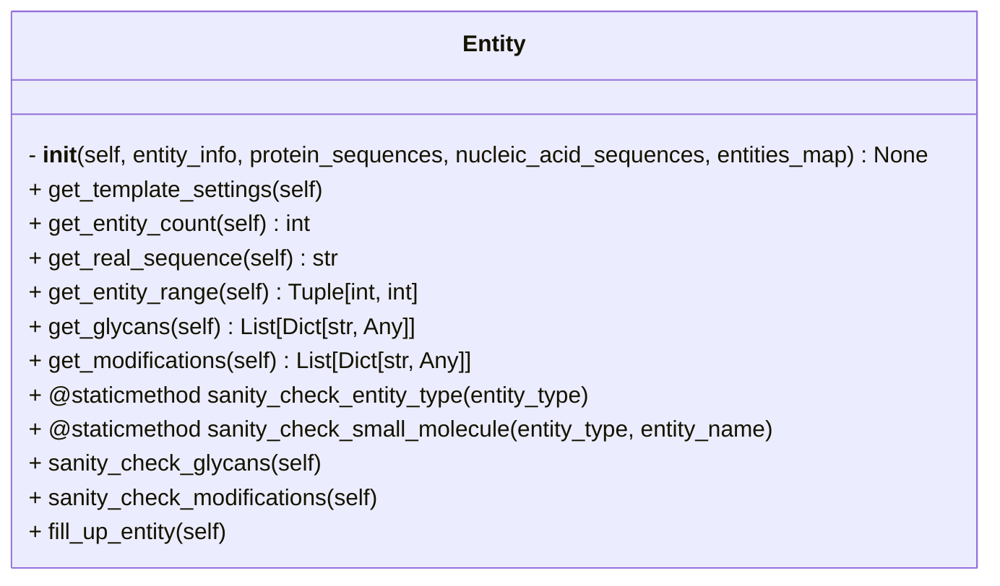

```python
class Entity
```



## Input

- **entity_info** (`Dict[str, Any]`) ^5d01f2
	- Dictionary containing entity attributes.
	- e.g.
```python
entity_info = {
	'name': 'Lb2Cas12a',
	'type': 'proteinChain',
	'count': 1,
	'useStructureTemplate': True,
	'maxTemplateDate': '2023-01-01',
	'glycans': [['BMA', 5]],
	'modifications': [['CCD_HY3', 11]]
}
```

- **protein_sequences** (`Dict[str, str]`) ^7568d0
	- Dictionary mapping Uniprot IDs/protein names to their amino acid sequences
	- e.g.
```python
protein_sequences = {
	'Lb2Cas12a': 'MYYESLTKQYPVS...',
	'P10989': 'MEEEIAALVID...',
	'P15924-1': 'MSCNGGSHPRINT...',
	'P39825': 'MSWQAYVDTSLLGT...'
}
```

- **nucleic_acid_sequences** (`Dict[str, str] | None = None`) ^8ed0dd
	- Dictionary mapping DNA/RNA entity name to their nucleotide sequences
	- e.g.
```python
nucleotide_sequences = {
	'DNA_25': 'TGGTCGGGGTAGCGGCTAAAGCACT',
	'DNA_mod': 'AGTGCTTTA',
	'RNA_33': 'AAUUUCUACUAAUUGUAGAUGCCGCUACCCCGA'}
```

- **entities_map** (`Dict[str, str] = {}`) ^05bf20
	- Mapping of entity names to their identifiers (e.g., Uniprot ID). Defaults to an empty dictionary
	- This is optional input and need not be specified if the sequence headers in `protein_sequences` match the entities name in the `jobs_info`.
	- e.g.
```python
entities_map = {
	'Act1': 'P10989',
	'Cdc3': 'P39825',
	'Dp1': 'P15924-1',
	'Lb2Cas12a': None
}
```

## Attributes

- **entity_info** (`Dict[str, Any]`)
	- same as [[#^5d01f2|entity_info]]

- **entities_map** (`Dict[str, str] = {}`)
	- same as [[#^05bf20|entities_map]]

- **protein_sequences** (`Dict[str, str]`)
	- same as [[#^7568d0|protein_sequences]]

- **nucleic_acid_sequences** (`Dict[str, str] | None = None`)
	- same as [[#^8ed0dd|nucleic_acid_sequences]]

- **entity_name** (`str`)
	- Name of the entity
	- e.g. `Act1`

- **entity_type** (`str`)
	- Type of the entity (`proteinChain`, `dnaSequence`, `rnaSequence` or `ion`)

- **entity_count** (`int = 1`)
	- Number of copies of the entity in the `af_job`

- **real_sequence** (`str | None = None`)
	- Amino acid sequence or nucleotide sequence of entity

- **start** (`int = 1`)
	- Start position of the entity in the full-length sequence

- **end** (`int | None = None`)
	- End position of the entity in the full-length sequence

- **glycans** (`List | None = None`)
	- List of glycan modifications
	- e.g.
```python
glycans = [{'position': 5, 'residues': 'BMA'}]
```

- **modifications** (`List | None = None`)
	- List of protein or DNA/RNA modifications
	- e.g.
```python
# for proteins
modifications = [{'ptmPosition': 11, 'ptmType': 'CCD_HY3'}]

#for nucleic acids
modifcations = [
	{'basePosition': 2, 'modificationType': 'CCD_6OG'},
	{'basePosition': 1, 'modificationType': 'CCD_6MA'}
]
```

## Methods

- [[get_template_settings]]
- [[get_entity_count]]
- [[get_real_sequence]]
- [[get_entity_range]]
- [[get_glycans]]
- [[get_modifications]]
- [[sanity_check_entity_type]]
- [[sanity_check_small_molecule]]
- [[sanity_check_glycans]]
- [[sanity_check_modifications]]
- [[fill_up_entity]]

## Tags
#class 