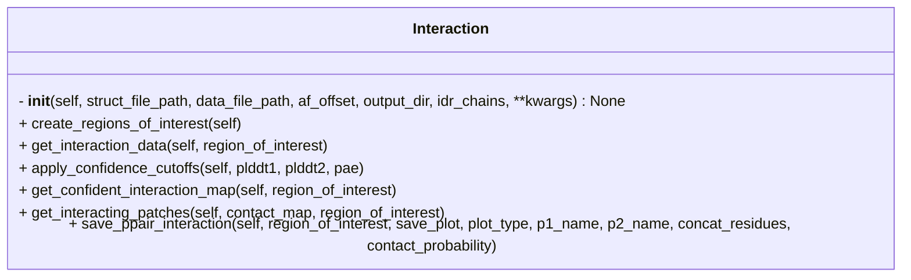

```python
class Interaction(_Initialize)
```



## Input

- **data_file_path** (`str`) ^f5ec42
	- Path to AF3 prediction `json` or `pkl` file

- **struct_file_path** (`str`) ^10d57c
	- Path to AF3 prediction `cif` or `pdb` file

- **af_offset** (`str`) ^fd6944
	- Offset indicating start and end residue number of each chain in the AF prediction
	- e.g.
```python
af_offset = {
	"A" : [1, 20],
	"B" : [5, 100]
}
```

- **output_dir** (`str`)
	- Path to the output directory

- **idr_chains** (`List`) ^7fb999
	- A list of chain IDs for IDR chains

## Attributes

- **struct_file_path** (`str`)
	- same as [[#^10d57c|struct_file_path]]

- **data_file_path** (`str`)
	- same as [[#^f5ec42|data_file_path]]

- **af_offset** (`Dict`)
	- same as [[#^fd6944|af_offset]]

- **interaction_map_type** (`str = contact`)
	- Type of interaction map

- **contact_threshold** (`int = 8`)
	- Distance threshold in (Å) to define a contact between residue pairs.

- **plddt_cutoff** (`int = 70`)
	- pLDDT cutoff to consider a confident prediction.

- **idr_plddt_cutoff** (`int = 50`)
	- pLDDT cutoff for IDR chains.

- **pae_cutoff** (`int = 5`)
	- PAE cutoff to consider a confident prediction

- **output_dir** (`str`)
	- Output directory to save the result

- **idr_chains** (`List`)
	- same as [[#^7fb999|idr_chains]]

- **save_plot** (`Bool = False`)
	- Whether to plot the output interacting patches

- **save_table** (`Bool = False`)
	- Whether to save the output interacting patches in a table

## Methods

- [[create_regions_of_interest]]
- [[get_interaction_data]]
- [[apply_confidence_cutoffs]]
- [[get_confident_interaction_map]]
- [[get_interacting_patches]]
- [[save_ppair_interaction]]

## Tags
#class 