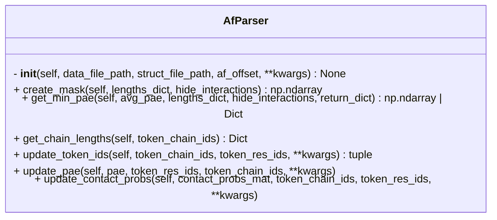

```python
class AfParser
```


```mermaid
classDiagram
    class AfParser {
        - __init__(self, data_file_path, struct_file_path, af_offset, **kwargs) None
        + create_mask(self, lengths_dict, hide_interactions) np.ndarray
        + get_min_pae(self, avg_pae, lengths_dict, hide_interactions, return_dict) np.ndarray | Dict
        + get_chain_lengths(self, token_chain_ids) Dict
        + update_token_ids(self, token_chain_ids, token_res_ids, **kwargs) tuple
        + update_pae(self, pae, token_res_ids, token_chain_ids, **kwargs)
        + update_contact_probs(self, contact_probs_mat, token_chain_ids, token_res_ids, **kwargs)
    }
```
