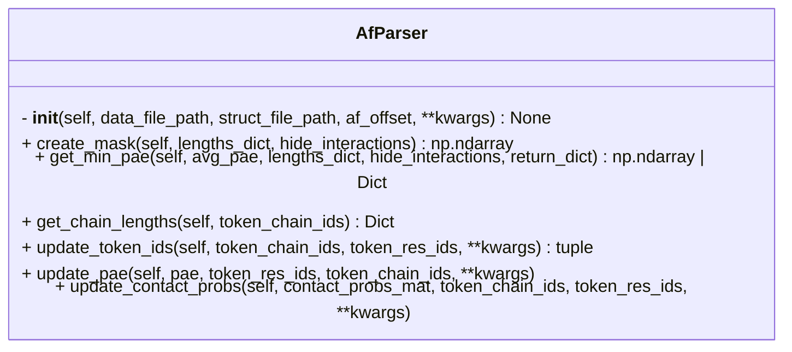

```python
class AfParser
	"""Parse the AF2/3 data and structure files.
	
	Attributes:
	
		data_file_path (str):
			Path to the AF2/3 data file.
	
		struct_file_path (str | None):
			Path to the AF2/3 structure file.
			(Default: None)
	
		dataparser (DataParser):
			Instance of DataParser class to parse the data file.
	
		structureparser (StructureParser | None):
			Instance of StructureParser class to parse the structure file.
			(Default: None)
	
		renumber (RenumberResidues):
			Instance of RenumberResidues class to renumber residues based on 
			the offset.
	
		af_offset (Dict | None):
			Offset describing start and end residue number for each chain in 
			the predicted structure.
			(Default: None) \n
	"""
```



## Input

- **data_file_path** (`str`) ^f5ec42
	- Path to AF3 prediction `json` or `pkl` file

- **struct_file_path** (`str`) ^10d57c
	- Path to AF3 prediction `cif` or `pdb` file

- **af_offset** (`str`)
	- Offset indicating start and end residue number of each chain in the AF prediction
	- e.g.
```python
af_offset = {
	"A" : [1, 20],
	"B" : [5, 100]
}
```


## Attributes

- **struct_file_path** (`str`)
	- same as [[#^10d57c|struct_file_path]]

- **data_file_path** (`str`)
	- same as [[#^f5ec42|data_file_path]]

- **dataparser** (`af_pipeline.Parser.DataParser`)
	- An instance of [[DataParser]]

- **structureparser** (`af_pipeline.Parser.StructureParser`)
	- An instance if [[StructureParser]]

- **renumber** (`af_pipeline.Parser.RenumberResidues`)
	- An instance of [[RenumberResidues]]

## Methods
- [[create_mask]]
- [[get_min_pae]]
- [[get_chain_lengths]]
- [[update_token_ids]]
- [[update_pae]]
- [[update_contact_probs]]

## Tags
#class 