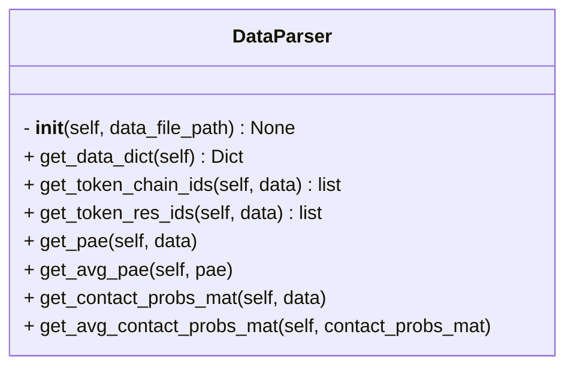

```python
class DataParser
    """Class containing methods to parse the AF2/3 data file.

    Attributes:

        data_file_path (str):
            Path to the AF2/3 data file.
    """
```



## Input

- **data_file_path** (`str`)
	- Path to AF3 prediction `json` or `pkl` file

## Attributes

- **data_file_path** (`str`)
	- same as [[#^f5ec42|data_file_path]]

## Methods

- [[get_data_dict]]
- [[get_token_chain_ids]]
- [[get_token_res_ids]]
- [[get_pae]]
- [[get_avg_pae]]
- [[get_contact_probs_mat]]
- [[get_avg_contact_probs_mat]]
- 