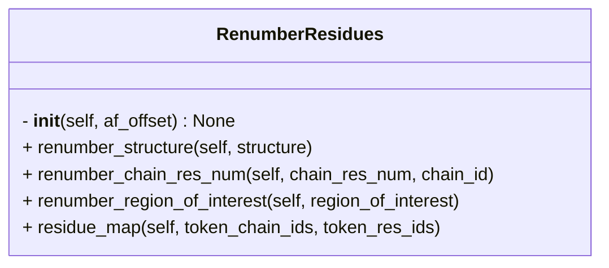

```python
class RenumberResidues
    """Class to renumber the residues based on the offset.

    Attributes:

        af_offset (Dict | None):
            Offset describing start and end residue number for each chain in 
	        the predicted structure.
    """
```



## Input

- **af_offset** (`dict`) ^048881
	- Offset indicating start and end residue number of each chain in the AF prediction
	- e.g.
```python
af_offset = {
	"A" : [1, 20],
	"B" : [5, 100]
}
```

## Attributes

- **af_offset** (`dict`)
	- same as [[#^048881|af_offset]]

## Methods
- [[renumber_structure]]
- [[renumber_chain_res_num]]
- [[renumber_region_of_interest]]
- [[residue_map]]

