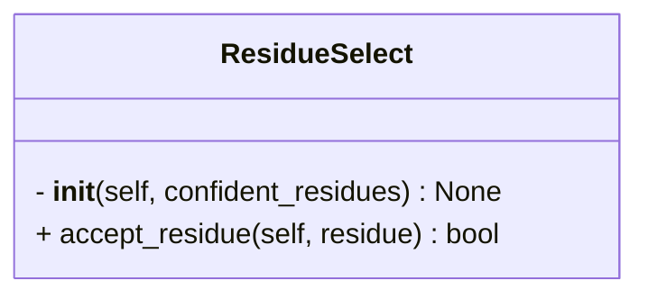

```python
class ResidueSelect(Select)
    """Class to select residues in the structure based on the input dictionary.

    Attributes:
        confident_residues (Dict):
            Dictionary containing the chain ID as key and a list of residue 
            numbers as value. \n
            e.g. {"A": [1, 2, 3], "B": [4, 5, 6]}
    """
```



## Input

- **confident_residues** (`Dict`) ^55cf55
	- Dictionary containing the chain ID as key and a list of residue numbers as value.
	- e.g.
```python
confident_residues = {
	"A" : [1,2,3,5,6,7],
	"B" : [5,6,7,50,51]
}
```

## Attributes

- **confident_residues** (`Dict`)
	- same as [[#^55cf55|confident_residues]]

## Methods

- [[accept_residue]]

## Tags
#class 