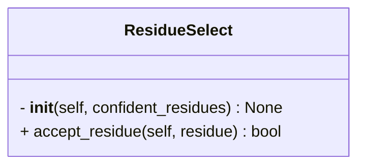

```python
class ResidueSelect(Select)
```



## Input

- **confident_residues** (`Dict`) ^55cf55
	- A dictionary of confident residues
	- e.g.
```python
confident_residues = {
	"A" : [1,2,3,5,6,7],
	"B" : [5,6,7,50,51]
}
```

## Attributes

- **confident_residues** (`Dict`)
	- same as [[#^55cf55|confident_residues]]

## Methods

- [[accept_residue]]

## Tags
#class 