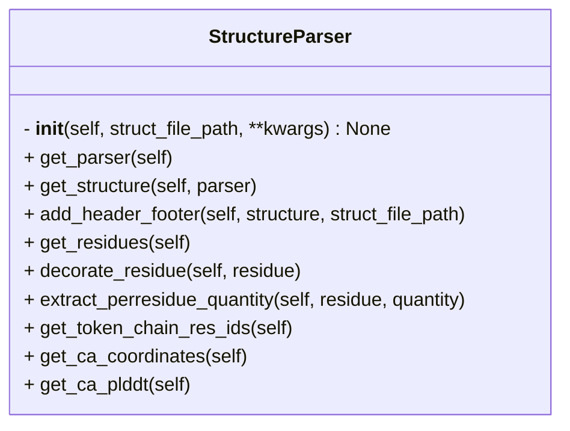

```python
class StructureParser
    """Class to parse the AF2/3 structure file.

    Attributes:
        struct_file_path (str):
            Path to the AF2/3 structure file (.pdb or .cif).

        preserve_header_footer (bool):
            If True, the header and footer information is preserved in the 
            structure object.
            This is only applicable for CIF files. \n
            (Default: False)

        which_parser (str):
            Which parser to use for the CIF file. \n
            "biopython" for Biopython's MMCIFParser, \n
            "pdbe" for PDBe's CifFileReader (not implemented yet). \n
            (Default: "biopython")

        structure (Bio.PDB.Structure.Structure):
            Biopython Structure object.
    """
```



## Input

- **struct_file_path** (`str`) ^10d57c
	- Path to AF3 prediction `cif` or `pdb` file

## Attributes

- **struct_file_path** (`str`)
	- same as [[#^10d57c|struct_file_path]]

- **preserve_header_footer** (`bool = False`)
	- A boolean indicating whether to preserve header and footer of the `cif` or `pdb`files

- **which_parser** (`str = biopython`)
	- Package to use to parse the `cif` or `pdb` files

- **structure** (`Bio.PDB.Structure.Structure`)
	- Biopython structure object

## Methods
- [[get_parser]]
- [[get_structure]]
- [[add_header_footer]]
- [[get_residues]]
- [[decorate_residues]]
- [[extract_perresidue_quantity]]
- [[get_token_chain_res_ids]]
- [[get_cb_coordinates]]
- [[get_cb_plddt]]

