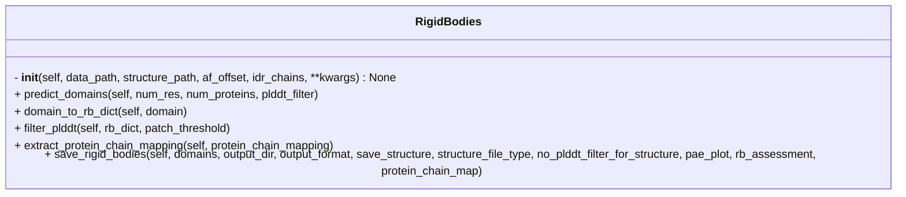

```python
class RigidBodies(_Initialize)
```



## Input

- **data_file_path** (`str`) ^f5ec42
	- Path to AF3 prediction `json` or `pkl` file

- **struct_file_path** (`str`) ^10d57c
	- Path to AF3 prediction `cif` or `pdb` file

- **af_offset** (`str`) ^fd6944
	- Offset indicating start and end residue number of each chain in the AF prediction
	- e.g.
```python
af_offset = {
	"A" : [1, 20],
	"B" : [5, 100]
}
```

- **output_dir** (`str`)
	- Path to the output directory

- **idr_chains** (`List`) ^7fb999
	- A list of chain IDs for IDR chains

## Attributes

- **struct_file_path** (`str`)
	- same as [[#^10d57c|struct_file_path]]

- **data_file_path** (`str`)
	- same as [[#^f5ec42|data_file_path]]

- **af_offset** (`Dict`)
	- same as [[#^fd6944|af_offset]]

- **idr_chains** (`List`)
	- same as [[#^7fb999|idr_chains]]

- **library** (`str = igraph`)
	- Library to use for community clustering (`igraph` or `networkx`)

- **pae_power** (`int = 1`)
	- Exponent to which the PAE matrix will be raised
	- This affects the edge weights in the graph

- **pae_cutoff** (`int = 5`)
	- PAE cutoff for creating the network
	- Edges won't be formed for the residue pairs with `pae < pae_cutoff`

- **resolution** (`float = 0.5`)
	- Resolution parameter

- **plddt_cutoff** (`int = 70`)
	- pLDDT cutoff for the rigid body
	- Residues below the cutoff will not be part of the rigid body

- **plddt_cutoff_idr** (`int = 50`)
	- pLDDT cutoff for the disordered chains in the rigid body

- **patch_threshold** (`int = 0`)
	- If there are `patch_threshold` consecutive residues missing in the rigid body, include them in the output

- **random_seed** (`int = 99`)
	- Random seed (if `library == "label_propagation"`)

## Methods

- [[predict_domains]]
- [[domain_to_rb_dict]]
- [[filter_plddt]]
- [[extract_protein_chain_mapping]]
- [[save_rigid_bodies]]