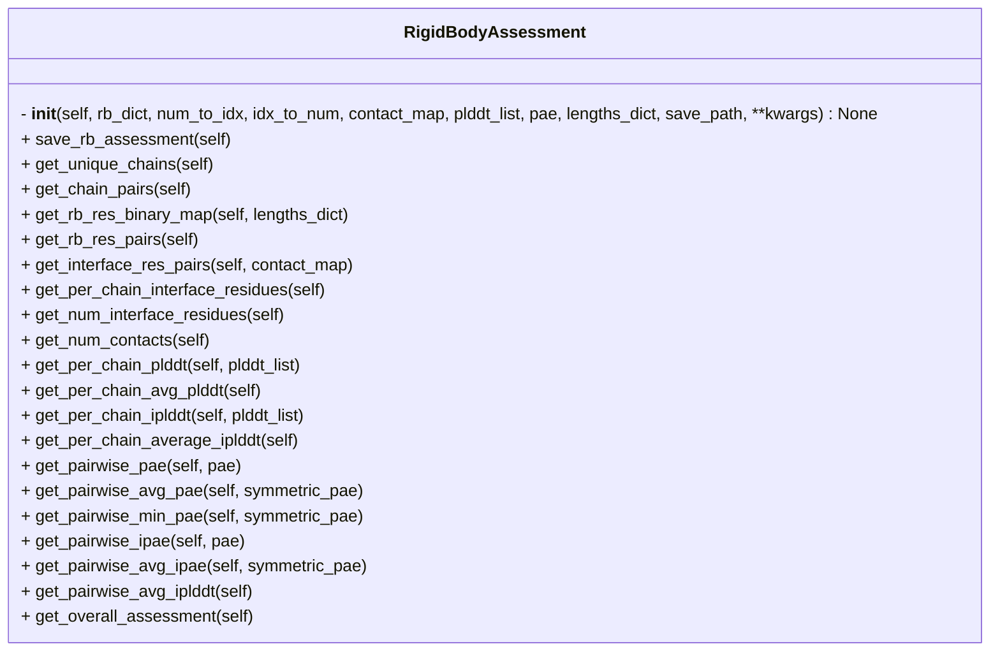

```python
class RigidBodyAssessment
```



## Input

- **rb_dict** (`Dict`) ^272d84
	- Dictionary of rigid bodies, where each rigid body is a dictionary with chain IDs as keys and residue numbers as values.

- **num_to_idx** (`Dict`) ^054b5a
	- Residue number to index mapping.

- **idx_to_num** (`Dict`) ^853f93
	- Residue index to number mapping

- **contact_map** (`NDArray`)
	- Binary contact map of the structure.

- **plddt_list** (`List`)
	- A list of pLDDT scores for each residue in the structure.

- **pae** (`NDArray`)
	- Predicted Alignment Error (PAE) matrix.

- **lengths_dict** (`Dict`)
	- A dictionary indicating number of residues in total and per chain in the prediction
	- e.g.
```python
lengths_dict = {
	"A": 20,
	"B": 10,
	"total": 30
}
```

- **save_path** (`str`) ^a16b86
	- Path to save the assessment results.

## Attributes

- **rb_dict** (`Dict`)
	- same as [[#^272d84|rb_dict]]

- **num_to_idx** (`Dict`)
	- same as [[#^054b5a|num_to_idx]]

- **idx_to_num** (`Dict`)
	- same as [[#^853f93|idx_to_num]]

- **symmetric_pae** (`bool = True`)
	- Whether to output PAE values in both directions or average

- **as_average** (`bool = False`)
	- Whether the output should have average metric values per interface

- **idr_chains** (`List = []`)
	- List of chain IDs of disordered chains in the prediction

- **protein_chain_map** (`Dict = {}`)
	- Dictionary to denote which chain is which protein

- **unique_chains** (`List`)
	- List of unique chains in the rigid body

- **chain_pairs** (`List`)
	- List of tuples of all possible chain pair combinations

- **rb_res_binary_map** (`NDArray`)

- **rb_res_pairs** (`Dict`)
	- Dictionary with residue pairs for each possible chain pair

- **per_chain_plddt** (`Dict`)
	- Dictionary denoting per chain per residue pLDDT values in the rigid body

- **per_chain_avg_plddt** (`Dict`)
	- Dictionary denoting average pLDDT score per chain in the rigid body

- **pairwise_pae** (`Dict`)
	- Dictionary of PAE values per chain pair per residue pair

- **interface_res_pairs** (`Dict`)
	- Dictionary denoting the interface residues per chain pair

- **per_chain_interface_residues** (`Dict`)
	- Dictionary with interface residues per chain

- **num_contacts** (`Dict`)
	- Dictionary denoting the number of contacts per chain pair

- **num_interface_residues** (`Dict`)
	- Dictionary denoting the number of interface residues per chain pair

- **pairwise_ipae** (`Dict`)
	- Dictionary denoting the iPAE values for each interface residue pair in interacting chains

- **per_chain_iplddt** (`Dict`)
	- Dictionary denoting pLDDT scores for interface residues per chain

- **per_chain_avg_iplddt** (`Dict`)
	- Dictionary denoting average pLDDT score for interface residues per chain

- **pairwise_avg_iplddt** (`Dict`)
	- Dictionary denoting the average PAE values for interface residue pairs for interacting chains

- **pairwise_min_pae** (`Dict`)
	- Dictionary denoting the minimum PAE value for each chain pair in the rigid body

- **pairwise_avg_pae** (`Dict`)
	- Dictionary denoting the average PAE value for each chain pair in the rigid body

- **pairwise_avg_ipae** (`Dict`)
	- Dictionary denoting the average iPAE value for the interacting chain pairs

- **overall_assessment** (`Dict`)
	- Overall assessment of the rigid body

- **save_path** (`str`)
	- same as [[#^a16b86|save_path]]

## Methods

- [[save_rb_assessment]]
- [[get_unique_chains]]
- [[get_chain_pairs]]
- [[get_rb_res_binary_map]]
- [[get_rb_res_pairs]]
- [[get_interface_res_pairs]]
- [[get_per_chain_interface_residues]]
- [[get_num_contacts]]
- [[get_per_chain_plddt]]
- [[get_per_chain_avg_plddt]]
- [[get_per_chain_iplddt]]
- [[get_per_chain_average_iplddt]]
- [[get_pairwise_pae]]
- [[get_pairwise_min_pae]]
- [[get_pairwise_ipae]]
- [[get_pairwise_avg_ipae]]
- [[get_pairwise_avg_iplddt]]
- [[get_overall_assessment]]

## Tags
#class 