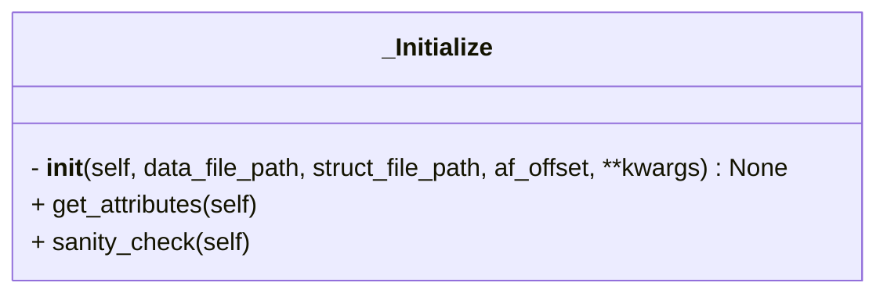

```python
class _Initialize(AfParser)
```



- Inherits from [[AfParser]]

## Input

- **data_file_path** (`str`) ^f5ec42
	- Path to AF3 prediction `json` or `pkl` file

- **struct_file_path** (`str`) ^10d57c
	- Path to AF3 prediction `cif` or `pdb` file

- **af_offset** (`str`) ^fd6944
	- Offset indicating start and end residue number of each chain in the AF prediction
	- e.g.
```python
af_offset = {
	"A" : [1, 20],
	"B" : [5, 100]
}
```


## Attributes

- **struct_file_path** (`str`)
	- same as [[#^10d57c|struct_file_path]]

- **data_file_path** (`str`)
	- same as [[#^f5ec42|data_file_path]]

- **af_offset** (`Dict`)
	- same as [[#^fd6944|af_offset]]

- **average_atom_pae** (`bool = False`)
	- Whether take average of all atoms in case the PAE values are per atom

- **pae** (`NDArray`)
	- PAE matrix (as is) for the prediction

- **avg_pae** (`NDArray`)
	- Symmetrized PAE matrix for the prediction

- **contact_probs_mat** (`NDArray`)
	- Contact probability matrix provided by AF3 for the prediction

- **avg_contact_probs_mat** (`NDArray`)
	- Symmetrized contact probability matrix

- **token_chain_ids** (`List`)
	- A list of token chain ids
	- e.g. 
```python
token_chain_ids = ["A", "A", "B"]
```

- **token_res_ids** (`List`)
	- A list of integers indicating indices for each token
	- e.g.
```python
token_res_ids = [1, 1, 1, 2, 3, 4, 5]
```

- **coords_list** (`List`)
	- A list of coordinates of representative atoms in the prediction

- **plddt_list** (`List`)
	- A list of pLDDT score for representative atom in each residue in the prediction

- **lengths_dict** (`Dict`)
	- A dictionary indicating number of residues in total and per chain in the prediction
	- e.g.
```python
lengths_dict = {
	"A": 20,
	"B": 10,
	"total": 30
}
```

- **idx_to_num** (`Dict`)
	- Residue index to residue number mapping in the prediction

- **num_to_idx** (`Dict`)
	- Residue number to residue index mapping in the prediction

### Methods

- [[get_attributes]]
- [[sanity_check]]

## Tags
#class 