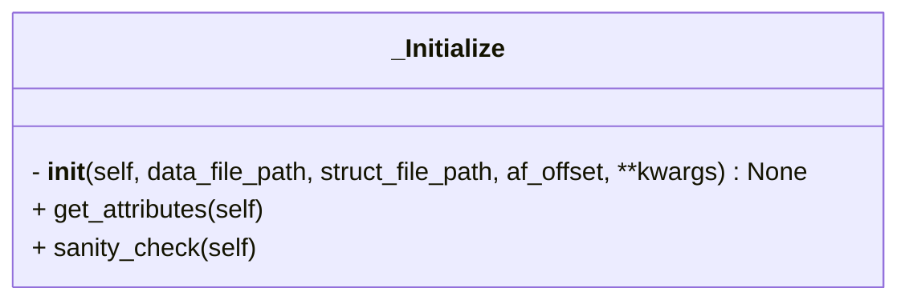

```python
class _Initialize(AfParser)
```


```mermaid
classDiagram
    class _Initialize {
        - __init__(self, data_file_path, struct_file_path, af_offset, **kwargs) None
        + get_attributes(self)
        + sanity_check(self)
    }
```

- Inherits from [[AfParser]]
- 