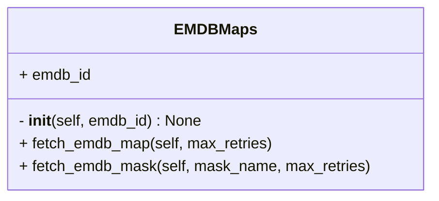

# Density
## Density

```mermaid
---
config:
    class:
        hideEmptyMembersBox: true
---
classDiagram
    class EMDBMaps {
        + emdb_id
        - __init__(self, emdb_id) None
        + fetch_emdb_map(self, max_retries)
        + fetch_emdb_mask(self, mask_name, max_retries)
    }
```

### Description
- Query [PDBe](https://ftp.ebi.ac.uk/pub/databases/emdb/structures/) to download EM maps and masks for given **EMDB ID**s