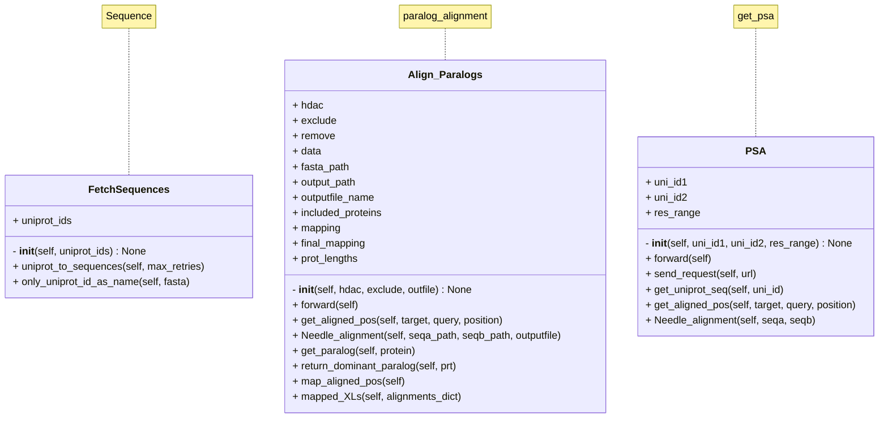

# Sequence

```mermaid
---
config:
    class:
        hideEmptyMembersBox: true
---
classDiagram
    note for FetchSequences "Sequence"
    class FetchSequences {
        + uniprot_ids
        - __init__(self, uniprot_ids) None
        + uniprot_to_sequences(self, max_retries)
        + only_uniprot_id_as_name(self, fasta)
    }
    note for Align_Paralogs "paralog_alignment"
    class Align_Paralogs {
        + hdac
        + exclude
        + remove
        + data
        + fasta_path
        + output_path
        + outputfile_name
        + included_proteins
        + mapping
        + final_mapping
        + prot_lengths
        - __init__(self, hdac, exclude, outfile) None
        + forward(self)
        + get_aligned_pos(self, target, query, position)
        + Needle_alignment(self, seqa_path, seqb_path, outputfile)
        + get_paralog(self, protein)
        + return_dominant_paralog(self, prt)
        + map_aligned_pos(self)
        + mapped_XLs(self, alignments_dict)
    }
    note for PSA "get_psa"
    class PSA {
        + uni_id1
        + uni_id2
        + res_range
        - __init__(self, uni_id1, uni_id2, res_range) None
        + forward(self)
        + send_request(self, url)
        + get_uniprot_seq(self, uni_id)
        + get_aligned_pos(self, target, query, position)
        + Needle_alignment(self, seqa, seqb)
    }

```

Check the following examples in the examples directory for usage.

- `fetch_sequences.py`