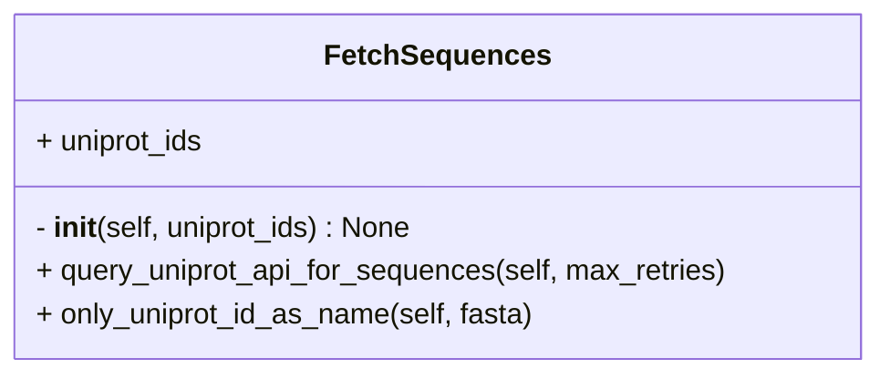
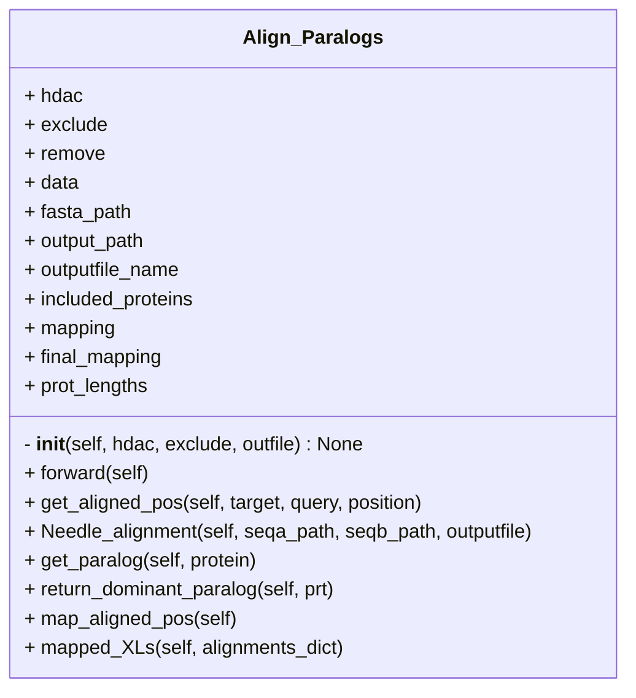
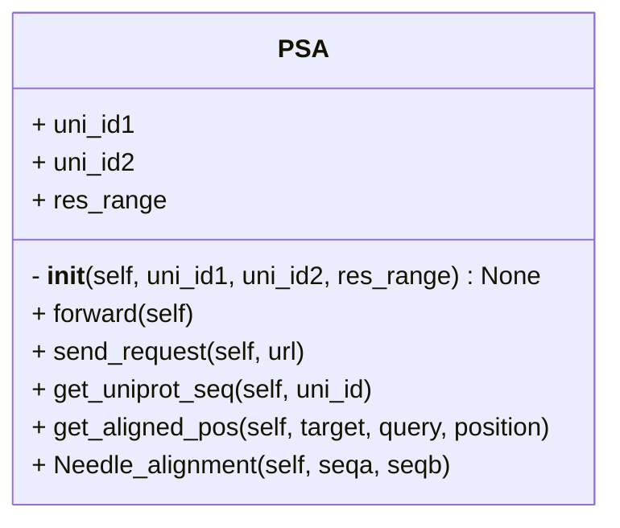

# Sequence
## Sequence

### Description
- Query [UniProt REST API](https://www.uniprot.org/help/api) to download protein sequences for give **UniProt ID**s
- example: https://rest.uniprot.org/uniprotkb/accessions?accessions=P60709&format=fasta

Refer to:
- `fetch_sequences.py` in IMP_Toolbox/examples for usage

## paralog_alignment

## get_psa

