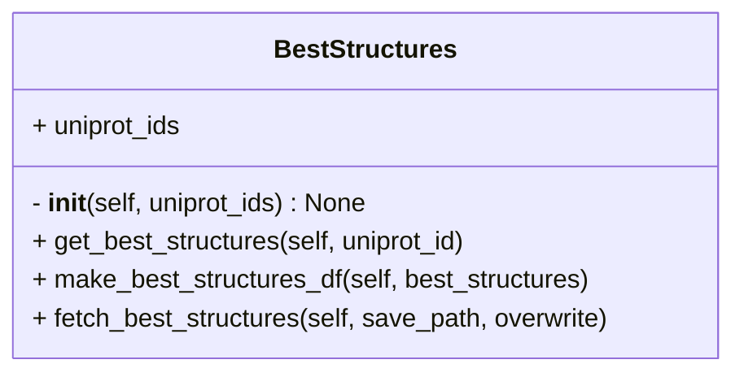

# Structure
## BestStructure

### Description
- Query [PDBe Graph API](https://www.ebi.ac.uk/pdbe/graph-api/pdbe_doc/) to find structures and related information (resolution, coverage, etc.) for given **UniProt ID**s
- example: https://www.ebi.ac.uk/pdbe/graph-api/mappings/best_structures/P60709

Refer to:
- `fetch_best_structures.py` in `IMP_Toolbox/examples` for usage
