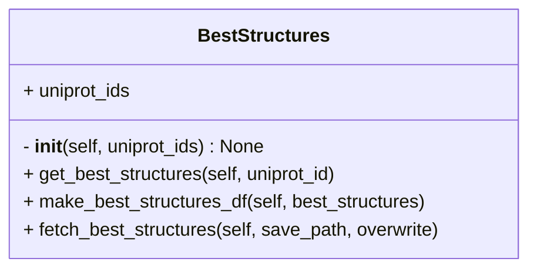

# Finding best structures for given proteins

<!-- 
Script to use: `best_structures.py`

How to use:

- `python best_structures.py -i proteins_dictionary.json -o best_structures.csv`
- `proteins_dictionary.json` should contain protein names and their uniprot identifiers. (see [cardiac_desmosome_proteins.json](https://github.com/isblab/IMP_Toolbox/blob/main/pre_processing/inputs/cardiac_desmosome_proteins.json) for reference)

What to expect:

- PDB identifiers, coverage, chain_id, start and end residues, resolution (see [best_structures.csv](https://github.com/isblab/IMP_Toolbox/blob/main/pre_processing/output/best_structures.csv) for reference)

# Prepare input json files for AF server
Scripts to use: `input_for_af_predictions.py`

How to use:

- `python input_for_af_predictions.py`
- You can create input files for the prediction in the batches of 20 given an input dictionary
- Please check the script for the format of the dictionary

What to expect:

- json files each containing 20 jobs at most that can be submitted to AF server (see [af_input](https://github.com/isblab/IMP_Toolbox/tree/main/pre_processing/output/af_input) for reference)

# Analyze AF output (only binary complexes)
Scripts to use: `analysing_af_output.py`

How to use:

- `python analysing_af_output.py --af_pipeline`
- Other parameters are optional through which you can set pLDDT, PAE and distance cutoffs and specify paths for input and output (use `-h` for more details)

What to expect:

- An image with three plots. (PAE matrix, interaction region PAE matrix, interaction region confident interactions) (see [af_contact_maps](https://github.com/isblab/IMP_Toolbox/tree/main/pre_processing/output/af_contact_maps) for reference)
- An interaction region on a protein is set as the region that just about covers all the confident interactions
- Confident interactions are decided by `af_pipeline`

# get_residues_in_pdb -->
